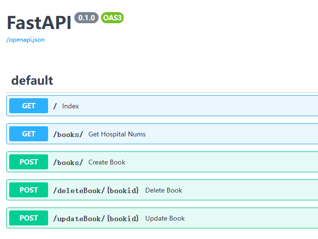

# FastAPI对数据库的增删改查
## 前言
FastAPI对数据库的操作通常是采用SQLAlchemy来实现的，这主要是由于后者会以面向对象的方式来操作表，同时SQLAlchemy用统一的接口使得程序与数据库相分离，降低了耦合度。
在FastAPI的官方文档中，有专门对SQLAlcheym的介绍，只不过该示例中是两个表，且表与表之间有外键约束，为了更清楚让刚入门的同学快速掌握FastAPI对数据库的操作，本文将以一个简单的表来说明如何在FastAPI中实现对数据库的增删改查操作。
## 整体思路
在官方文档中，FastAPI采用SQLAlchemy对数据库的操作是采用一种非常清晰的模块划分方式，即要操作一个数据表，通常用五个文件来实现：
- 数据库配置文件：
**database.py**主要完成对数据库的连接；
- 数据库中表对应的模型文件：
**models.py**建立所需要的表对应的数据模型；
- 数据库中表所对应的架构文件：
**schemas.py**这里采用pydantic来完成对数据表的基本校验，其实质是建立与表对应的类，它与**models.py**中类的区别在于**models.py**中是与表严格对应的，而schemas则可以根据表模型来定制适合不同场景的类。
- 增删改查操作文件：
**crud.py**该文件中主要完成对数据库的各种读写操作。
- 主文件
**main.py**这里配置各种路由及get、post等方法。
本例中将以一个图书数据库来实现增删改查操作。接下来一起看看各种文件的设定。
## 一、数据库的连接
在本例中，我们将以sqlite3数据库来实现图书数据库的管理，这里要注意的是，如果采用sqlite3，则配置中的**check_same_thread**标记要设定为False，这是因为sqlite3数据库本身并非一个网络数据库，其默认只能在同一线程中使用，如果不设定该标记，则SQLAlchemy会提示错误，具体代码如下所示：
>backend/database.py
```python
from sqlalchemy import create_engine # type: ignore
from sqlalchemy.ext.declarative import declarative_base # type: ignore
from sqlalchemy.orm import sessionmaker # type: ignore

SQLALCHEMY_DATABASE_URL = "sqlite:///./sql_app.db"
engine = create_engine(
    SQLALCHEMY_DATABASE_URL, connect_args={"check_same_thread": False}
)

SessionLocal = sessionmaker(autocommit=False, autoflush=False, bind=engine)

Base = declarative_base()
```
在上述代码中，通过创建一个SessionLocal变量，将当前数据库的连接保存于其中，这样可在其它文件中将其导入使用。
Base是SQLAlchemy的总类，与数据库表对应的数据模型均须继承它。
:::tip
如果要使用mysql数据库，则连接字符串如下："mysql+pymysql://用户名:密码@主机IP:端口/数据库名?charset=utf8"
建立数据表模型
:::
为演示简单，这里的数据表仅包含三个字段：ID、书名、定价。在当前目录下建立文件**models.py**代码如下：
>backend/models.py
```python
from sqlalchemy import Column, Integer, String  # type: ignore
from .database import Base


class Books(Base):
    __tablename__ = "books"

    id = Column(Integer, primary_key=True, index=True)
    bookname = Column(String(100), unique=True)
    prices = Column(Integer)
```   
在上述代码中，我们建立了表名为books的类Books，该类包含了之前提到的三个字段，注意，这里的书名价格用的是整数表示。
在这里，我们用`from .database import Base`导入了刚才创建的基类，对于某些编辑器会提示这里的导入警告，一个合适的办法是在当前文件夹下新建一个__init__.py空文件，这样语法检查器会认为这是一个包，可以被导入而不会出现警告信息。
## 二、建立架构文件
在[关于FastAPI与Vue3的通信](./关于FastAPI与Vue3的通信.md)已经介绍过利用pydantic来检验前端传输数据的功能，这里同样用该包来完成输入或输出数据的类设定，在同一个目录下建立文件**schemas.py**文件，其中建立一个与模型类完全一致的类，这主要是要利用其id属性来完成更改数据的功能，再建立一个去掉id的类，用来新建数据时使用，代码如下：
>backend/schemas.py
```python
from typing import Union
from pydantic import BaseModel

class Books(BaseModel): 
    id: Union[int, None]=None   
    bookname : str
    prices : Union[int, None] = None

    class Config:
        orm_mode = True

class BooksBase(BaseModel):
    bookname : str
    prices : Union[int, None] = None
```
:::tip 代码解释
在上述代码中，类Books有一个内部类class Config，这是pydantic中的一个配置，将其中的orm_mode设定为True，即告诉pydantic，这是一个可以直接映射为对象关系模型的类。而BooksBase类则只是对数据进行校验。
:::
当然，我们可以利用类的继承功能，将上述代码改写如下：
>backend/schemas.py
```python
from typing import Union
from pydantic import BaseModel

class BooksBase(BaseModel):     
    bookname : str
    prices : Union[int, None] = None

class Books(BooksBase): 
    id: Union[int, None]=None
    class Config:
        orm_mode = True
```
## 三、增删改查
对数据表的操作单独用一个文件来收集，在同一个目录下建立文件**crud.py**，其中的增删改查代码如下：
>backend/crud.py
```python
from datetime import date
from sqlalchemy.orm import Session
from . import models, schemas 

# 根据书名查询，支持模糊查询
def get_books_by_name(db: Session, bookname: str):
    return db.query(models.Books).filter(models.Books.bookname.like(f"%{bookname}%")).all()

# 根据书的`ID`删除
def delete_book_by_Id(db:Session, bookId:int):
    db_book = db.query(models.Books).filter(models.Books.id == bookId).one_or_none()
    if db_book is None:
        return None
    db.delete(db_book)
    db.commit()
    return True

# 增加书籍信息
def create_book(db:Session, book:schemas.BooksBase):
    curBook = models.Books(
        bookname = book.bookname,
        prices = book.prices,        
    )
    db.add(curBook)
    db.commit()
    db.refresh(curBook)
    return curBook

# 根据书的`ID`修改书籍信息
def update_book_by_id(db:Session, bookId:int, book:schemas.BooksBase):
    db_book = db.query(models.Books).filter(models.Books.id == bookId).one_or_none()
    if db_book is None:
        return None

    # Update model class variable from requested fields 
    for var, value in vars(book).items():
        setattr(db_book, var, value) if value else None
    db.commit()
    db.refresh(db_book)
    return db_book
```
:::tip
上述修改书籍的代码中，我们利用了Python中的vars这个函数，它可以将一个对象的所有属性以字典的方式列举。
:::
## 四、整合路由
最后，我们在该目录下的**main.py**文件中设定各种不同的路由，调用上述**crud.py**中的函数来完成对数据表的增删改查，代码如下：
>backend/main.py
```python
from fastapi import Depends, FastAPI, HTTPException
from sqlalchemy.orm import Session #type: ignore
from . import crud, schemas, models
from .database import SessionLocal, engine

# 根据模板文件创建对应的数据表
models.Base.metadata.create_all(bind=engine)

app = FastAPI()

# 设定数据库连接
def get_db():
    db = SessionLocal()
    try:
        yield db
    finally:
        db.close()

# 查询书籍
@app.get("/books/", response_model=list[schemas.Books])
def get_hospital_nums(bookname:str, db:Session=Depends(get_db)):
    db_books = crud.get_books_by_name(db, bookname=bookname)    
    if not db_books:
        raise HTTPException(status_code=400, detail="当前书籍名称未查询到相匹配的书籍。")
    return db_books

# 删除书籍
@app.post("/deleteBook/{bookid}")
def delete_book(bookid:int, db:Session=Depends(get_db)):
    return crud.delete_book_by_Id(db, bookId=bookid)

# 修改书籍
@app.post("/updateBook/{bookid}", response_model=schemas.Books)
def update_book(bookid:int, book:schemas.BooksBase, db:Session=Depends(get_db)):
    return crud.update_book_by_id(db, bookId=bookid, book=book)

# 新增书籍
@app.post("/books/", response_model=schemas.Books)
def create_book(book: schemas.BooksBase, db: Session = Depends(get_db)):
    db_book = crud.get_books_by_name(db, bookname=book.bookname)
    if db_book:
        raise HTTPException(status_code=400, detail="该书籍已经存在。")
    return crud.create_book(db=db, book=book)
```
至此，五个文件已经全部完成，接下来我们要测试一下这些功能。
:::warning 注意事项
在导入文件时，一定要注意：
上述文件中，我们是用`from . import XXX`的方式导入当前文件夹下的其它文件，在这种情况下，如果要成功运行，必须将目录切换至backend的上一级来运行才可以。如果省略.，直接用`import XXX`来导入当前文件夹下的其它文件，则必须在backend这个当前目录下运行服务器uvicorn的命令
:::
我们采用在backend文件夹的上一级运行服务器的方式。
## 五、测试增删改查功能
将目录切换至backend的上一级，在命令窗口运行下列命令：
`uvicorn backend.main:app --reload --port 8001`
然后你会发现在backend的上一级目录中生成了一个数据库文件sql_app.db，此时如果用DB Browser for SQLite这个软件来查看该数据库文件时，会发现我们定义的表已经在其中创建了。

在FastAPI中，有一个非常强大的文档功能，它可以让我们对刚才编写的程序进行测试。在浏览器地址栏输入<http://127.0.0.1:8001/docs>，进入swagger用户界面，用以管理接口数据。这里只用其来测试我们上述编写的代码是否能成功操作数据库。
  

- 增加数据
- 查询
- 修改
- 删除

## 小结
在本文中，我们用一个小例子来说明了如何利用FastAPI和SQLAlchemy来对数据库进行增删除改查操作，熟悉该过程，有助于我们加深对FastAPI操作数据库的理解。
## 仓库代码
[仓库代码展示](https://gitee.com/windstarry/fastapi_vue_demo)
## 相关文章
1. [关于FastAPI与Vue3的通信](./关于FastAPI与Vue3的通信.md)
2. [FastAPI对数据库的增删改查](./FastAPI对数据库的增删改查.md)
3. [基于Vue3和FastAPI对数据库进行操作](./基于Vue3和FastAPI对数据库进行操作.md)