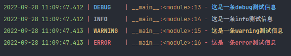
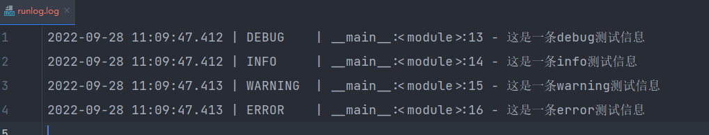
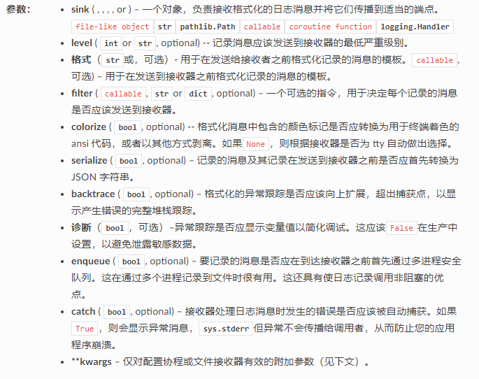
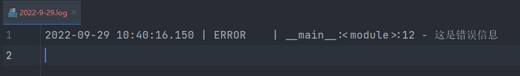
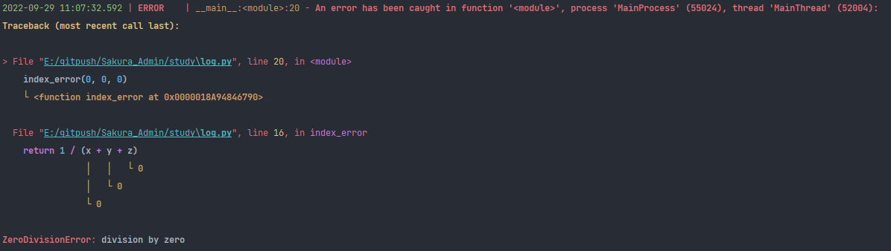
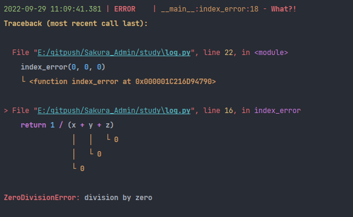
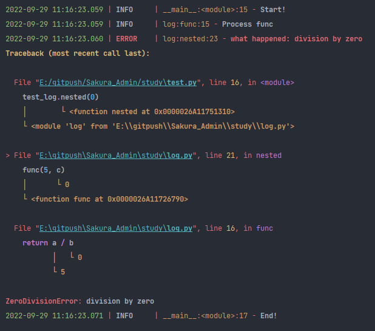
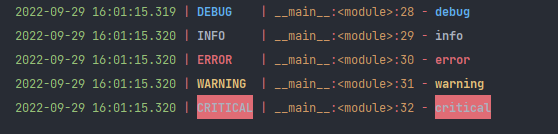
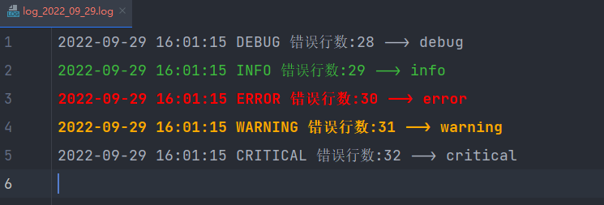

# Loguru日志写入基础
## 安装
```shell
pip install loguru
```
## 日志等级

|Level name | 严重性值 | 记录器方法|
| :------:| :------: |:------: |
| TRACE | 5 | logger.trace()|
|DEBUG |10 |logger.debug()|
|INFO|20|logger.info()|
|SUCCESS|25|logger.success()|
|WARNING|30|logger.warning()|
|ERROR|40|logger.error()|
|CRITICAL|50|logger.critical()|

## 基本使用
### loguru基础使用
```python
from loguru import logger

logger.add('runlog.log', encoding='utf-8')
logger.debug('这是一条debug测试信息')
logger.info('这是一条info测试信息')
logger.warning('这是一条warning测试信息')
logger.error('这是一条error测试信息')
```
  
  

### loguru配置日志文件
>logger 默认采用 sys.stderr 标准错误输出将日志输出到控制台中，假如想要将日志同时输出到其他的位置，比如日志文件，此时我们只需要使用一行代码即可实现。

例如：将日志信息输出到2022-9-28.log文件中，可以这么实现：
```python
from loguru import logger

logger.add('/Sakura_Admin/study/2022-9-18.log', rotation="500MB", encoding="UTF-8", enqueue=True,
           retention="10 days")
logger.info("这是一条info测试信息")
```
### 日志内容的字符串格式化
```python
import platform

from loguru import logger

trace = logger.add("2022-9-18.log")
# 格式化方法一
logger.info('If you are using Python {version}, prefer {feature} of course!', version=platform.python_version(),
            feature='f-strings')
# 格式化方法二
version = platform.python_version()
feature = 'f-strings'
logger.info(f'If you are using Python {version}, prefer {feature} of course!')
```
### loguru日志常用配置参数配置解析
  
>如果当接收器（sink）是文件路径（ pathlib.Path ）时，可以应用下列参数，同时add() 会返回与所添加的接收器相关联的标识符
- rotation：分隔日志文件，何时关闭当前日志文件并启动一个新文件的条件。例如："500 MB"、"0.5 GB"、"1 month 2 weeks"、"10h"、"monthly"、"18:00"、"sunday"、"monday at 18:00"、"06:15"
- retention：可配置旧日志的最长保留时间。例如："1 week, 3 days"、"2 months"
- compression ：日志文件在关闭时应转换为的压缩或归档格式，例如，"gz"、"bz2"、"xz"、"lzma"、"tar"、"tar.gz"、"tar.bz2"、"tar.xz"、"zip"
- delay：是否应该在配置了接收器之后立即创建文件，或者延迟到第一个记录的消息。默认为' False '
- mode ：与内置open()函数一样的打开模式。默认为 "a"(以附加模式打开文件)
- buffering ：内置open()函数的缓冲策略，它默认为1(行缓冲文件)
- encoding ： 内置open()函数的文件编码。它默认为"utf8"
- **kwargs：其他参数传递给内置open()函数

### loguru日志常用方法
>停止日志记录到文件中
>add()方法添加sink之后我们也可以对其进行删除，删除的时候根据刚刚add()方法返回的id进行删除即可，还原到标准输出。
```python
from loguru import logger

trance = logger.add("{time}.log", encoding="utf-8")
logger.error("这是错误信息")
logger.remove(trance)
logger.warning("这是警告信息")
```
>通过 logger.remove(handler_id=None) 删除以前添加的处理程序，并停止向其接收器发送日志。然后通过add() 添加输出日志文件，即可实现只输出到日志，不在console输出，如下：
```python
from loguru import logger

logger.remove(handler_id=None,)
trace = logger.add('2022-9-29.log', encoding="utf-8")
logger.error("这是错误信息")
logger.warning("这是警告信息")
```
### filter配置日志过滤规则
>我们通过实现自定义方法error_only，判断日志级别，当日志级别为ERROR，返回TRUE，我们在add()方法设置filter参数时，设置为error_only，即可过滤掉ERROR以外的所有日志 。
```python
from loguru import logger


def error_only(record):
    """
    error 日志判断
    :param record:
    :return: 若日志级别为error，输出bug
    """
    return record["level"].name == "ERROR"


logger.add("2022-9-29.log", filter=error_only,encoding="utf-8")
logger.error("这是错误信息")
logger.warning("这是警告信息")
```

### format配置日志记录格式化模板
```python
from loguru import logger


def format_log():
    """
    日志记录格式化模板
    :return:
    """
    logger.add("2022-9-29.log", encoding="utf-8",
               format="{time:YYYY-MM-DD HH:mm:ss} {level} From {module}.{function} : {message}")
    logger.warning("这是警告信息")


if __name__ == '__main__':
    format_log()
```
>展示所有信息
```python
logger.add("2022-9-29.log", encoding="utf-8",
               format="时间:{time:YYYY-MM-DD HH:mm:ss} 级别:{level} 行号:{line} 调用模块:{module} 调用函数:{function} --> 记录的消息:{message} 线程名:{thread}")
logger.warning("这是警告信息")
```

### extra bind()添加额外属性来为结构化日志提供更多属性信
```python
from loguru import logger


def format_log():
    """
    日志记录格式化模板
    :return:
    """
    trace = logger.add('2022-9-29.log', encoding='utf-8',
                       format="{time:YYYY-MM-DD HH:mm:ss} {extra[ip]}  {extra[username]} {level} From {module}.{function} : {message}")
    extra_logger = logger.bind(ip="192.168.0.1", username="张三")
    extra_logger.info('这是一条info信息')
    extra_logger.bind(username="李四").error("这是一条error信息")
    extra_logger.warning('这是一条警告信息')


if __name__ == '__main__':
    format_log()
```
### level配置日志最低日志级别
```python(3)
from loguru import logger

trance = logger.add('2022-9-29.log', encoding='utf-8', level='ERROR')
logger.error("这是错误信息")
logger.info('这是一条info测试信息')
```
>如下，我们可以看到在 2022-9-29.log 日志文件中，只看到记录了ERROR的记录：
  


### rotation 配置日志滚动记录的机制
我们想周期性的创建日志文件，或者按照文件大小自动分隔日志文件，我们可以直接使用 add() 方法的 rotation 参数进行配置。
```Python
from loguru import logger

trance = logger.add('2022-9-29.log', encoding='utf-8', rotation='200 MB')
```
例如，每天6点创建一个日志文件，如下：
```Python
from loguru import logger

trance = logger.add('2022-9-29.log', encoding='utf-8', rotation='06:00')
```
例如，每隔2周创建一个 日志文件，如下：
```Python
from loguru import logger

trace = logger.add('2022-9-29.log', encoding='utf-8', rotation='2 week')
```
### retention 配置日志保留机制
>通常，一些久远的日志文件，需要周期性的去清除，避免日志堆积，浪费存储空间。我们可以通过 add() 方法的 retention 参数可以配置日志的最长保留时间。
例如，设置日志文件最长保留 7 天，如下：
```python
from loguru import logger

trace = logger.add('2022-9-29.log', encoding='utf-8', retention='7 days')
```

### compression 配置日志压缩格式
>loguru 还可以配置文件的压缩格式，比如使用 zip 文件格式保存，示例如下：
```python
from loguru import logger

trace = logger.add('2022-9-29.log', encoding='utf-8', compression='zip')
```
### serialize 日志序列化
>如果我们希望输出类似于Json-line格式的结构化日志，我们可以通过 serialize 参数，将日志信息序列化的json格式写入log 文件，最后可以将日志文件导入类似于MongoDB、ElasticSearch 中用作后续的日志分析，代码示例如下：
```python
from loguru import logger
import platform

rounded_value = round(0.345, 2)
trance = logger.add('2022-9-29.log', encoding='utf-8', serialize=True)
logger.info('If you are using Python {version}, prefer {feature} of course!', version=platform.python_version(),
            feature='f-strings')
```

### Traceback 记录（异常追溯）
>loguru集成了一个名为 better_exceptions 的库，不仅能够将异常和错误记录，并且还能对异常进行追溯，如下，我们通过在遍历列表的过程中删除列表元素，以触发IndexError 异常，
通过catch装饰器的方式实现异常捕获，代码示例如下：
```python
from loguru import logger

trance = logger.add('2022-9-29.log', encoding='utf-8')


@logger.catch
def index_error(x, y, z):
    return 1 / (x + y + z)


if __name__ == '__main__':
    index_error(0, 0, 0)
```
>运行上述代码，我们可以发现loguru输出的 Traceback 日志信息， Traceback 日志信息中同时输出了当时的变量值，如下：
  
>对类中的方法和静态方法的代码实例：
```python
from loguru import logger

trance = logger.add('2022-9-29.log', encoding='utf-8')


class Demo:
    @logger.catch
    def index_error(self, custom_list: list):
        for index in range(len(custom_list)):
            index_value = custom_list[index]
            if index_value < 2:
                custom_list.remove(index_value)

    @staticmethod
    @logger.catch
    def index_error_static(custom_list: list):
        for index in range(len(custom_list)):
            index_value = custom_list[index]
            if index_value <= 2:
                custom_list.remove(index_value)


if __name__ == '__main__':
    Demo.index_error([1, 2, 3])
    Demo.index_error_static([1, 2])
```

### 通过logger.exception方法实现异常的捕获与记录
```python
from loguru import logger

trance = logger.add('2022-9-29.log', encoding='utf-8')


def index_error(x, y, z):
    try:
        return 1 / (x + y + z)
    except ZeroDivisionError:
        logger.exception("What?!")


if __name__ == '__main__':
    index_error(0, 0, 0)
```
>运行上述代码，我们可以发现loguru输出的 Traceback 日志信息， Traceback 日志信息中同时输出了当时的变量值，如下：
  


### loguru在多模块情况下使用
>Asynchronous, Thread-safe, Multiprocess-safe
由于在 loguru 中有且仅有一个对象：logger。所以loguru是可以在多块module文件中使用的，而且不会出现冲突：
```python
from loguru import logger


def func(a, b):
    logger.info("Process func")
    return a / b


def nested(c):
    try:
        func(5, c)
    except ZeroDivisionError as e:
        logger.exception("what happened: {}".format(e))
```
```python
from loguru import logger

import log as test_log

if __name__ == '__main__':
    logger.add("run.log", encoding='utf-8')
    logger.info("Start!")
    test_log.nested(0)
    logger.info("End!")
```
  


### loguru在多线程情况下的使用
```python
from atexit import register
from random import randrange
from threading import Thread, Lock, current_thread
from time import sleep
from loguru import logger


class CleanOutputSet(set):
    def __str__(self):
        return '.'.join(self)


lock = Lock()
loops = (randrange(1, 2) for _ in range(randrange(3, 4)))
remaining = CleanOutputSet()


def loop(nsec):
    myname = current_thread().name
    logger.info(f"Startted {myname}")
    # 锁的申请和释放交给with上下文管理器
    with lock:
        remaining.add(myname)
    sleep(nsec)
    logger.info("Completed {} ({} secs)", myname, nsec)
    with lock:
        remaining.remove(myname)
        logger.info("Remaining:{}", (remaining or 'NONE'))


# _main()函数是一个特殊的函数，只有这个模块从命令行直接运行时才会执行该函数（不能被其他模块导入）
def _main():
    for pause in loops:
        Thread(target=loop, args=(pause,)).start()


# 这个函数（装饰器的方式）会在python解释器中注册一个退出函数，也就是说，他会在脚本退出之前请求调用这个特殊函数
@register
def _atexit():
    logger.info("All Thread DONE!")
    logger.info("\n===========================================================================\n")


if __name__ == '__main__':
    logger.add("run.log", encoding='utf-8')
    _main()
```
>上面代码创建了3个线程，每个线程都正确打印出了日志信息。

### 漂亮的颜色记录
如果您的终端兼容，Loguru 会自动为您的日志添加颜色。可以使用接收器格式的标记标签来定义您喜欢的样式。
|描述|前景|背景|
| :------:| :------: |:------: |
|基本颜色 | \<red>,\<r> | \<GREEN>,\<G>|
|浅色|\<light-blue>,\<le>|\<LIGHT-CYAN>,\<LC>|
|8 位颜色|\<fg 86>,\<fg 255>|\<bg 42>,\<bg 9>|
|十六进制颜色|\<fg #00005f>,\<fg #EE1>|\<bg #AF5FD7>,\<bg #fff>|
|RGB 颜色|\<fg 0,95,0>|\<bg 72,119,65>|
|风格化|\<bold>, \<b>, \<underline>,\<u>| |

### 简单封装logure方法
```python
import loguru
import time
from pathlib import Path

project_path = Path.cwd().parent
log_path = Path(project_path, "log")
t = time.strftime("%Y_%m_%d")


class MyLogging(object):
    def __new__(cls, *args, **kwargs):
        logger = loguru.logger
        logger.add(f"{log_path}/log_{t}.log", rotation="500MB", encoding="utf-8", enqueue=True, retention="10 days",
                   format="{time:YYYY-MM-DD HH:mm:ss} {level} 错误行数:{line} --> {message}")
        return logger


my_log = MyLogging()
if __name__ == '__main__':
    my_log.debug("debug")
    my_log.info("info")
    my_log.error("error")
    my_log.warning("warning")
    my_log.critical("critical")
```
  
>在根目录生成log文件夹，里面生成一个log_xxx.log的一个log文件
  
