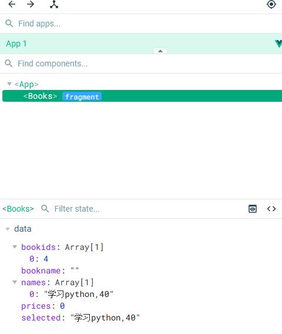

# 基于Vue3和FastAPI对数据库进行操作
## 前言
在[FastAPI对数据库的增删改查](./FastAPI对数据库的增删改查.md)中，介绍了如何利用FastAPI对数据库的增删改查，这属于服务器端的操作，那么如何结合客户端一起操作数据呢？
这篇文章来详细讨论一下如何利用Vue3作客户端对数据库进行操作。
## 服务器端的设置
关于如何进行FastAPI和VUE3的通信问题，[关于FastAPI与Vue3的通信](./关于FastAPI与Vue3的通信.md)中已有详细介绍，其实质是分别告诉前后端该对谁的访问进行响应以及该响应谁。
在**backend/main.py**文件中声明客户端的地址，代码如下：
```python
from fastapi.middleware.cors import CORSMiddleware
app.add_middleware(
    CORSMiddleware,    
    allow_origins= "http://127.0.0.1:5174/",    
    allow_credentials=True,
    allow_methods=["*"],
    allow_headers=["*"],    
)
```
其余部分同样遵从[FastAPI对数据库的增删改查](./FastAPI对数据库的增删改查.md)的文件结构：
```txt
├─ backend
│  ├─ crud.py
│  ├─ database.py
│  ├─ main.py
│  ├─ models.py
│  ├─ schemas.py
│  ├─ __init__.py
```
然后将当前目录切换至backend的上一级，在命令行运行如下命令：
`uvicorn backend.main:app --reload --port 8001`
这样，服务器端即开始监听<http://127.0.0.1:5174/>的响应。
## 客户端的操作
由于客户端是用官方的脚手架工具命令`yarn create vite frontend --template vue`生成的，其生成结构如下图所示：
```txt
├─ frontend
│  ├─ .vscode
│  │  └─ extensions.json
│  ├─ index.html
│  ├─ package.json
│  ├─ public
│  │  └─ vite.svg
│  ├─ README.md
│  ├─ src
│  │  ├─ App.vue
│  │  ├─ assets
│  │  │  └─ vue.svg
│  │  ├─ components
│  │  │  └─ HelloWorld.vue
│  │  ├─ main.js
│  │  └─ style.css
│  ├─ vite.config.js
│  └─ yarn.lock
```
先在**src/components**中建立**Books.vue**单文件组件，然后将**src/App.vue**中的内容全部删除，添加如下代码：
```vue
<script setup>
  import Books from './components/Books.vue'  
</script>

<template>
  <div>
    <Books />
  </div>
</template>
```
src的详细目录内容如下：
```txt
├─ src
│  │  ├─ App.vue
│  │  ├─ assets
│  │  │  └─ vue.svg
│  │  ├─ components
│  │  │  ├─ Books.vue
│  │  │  └─ HelloWorld.vue
│  │  ├─ main.js
│  │  └─ style.css
```
需要对数据库的操作均需要在**Books.vue**文件中完成。
## 客户端模板框架
在vue的官网上有提供一个CRUD的程序，其地址是：<https://cn.vuejs.org/examples/#crud>，接下来以该程序中的内容为**Books.vue**文件的基础，再来添加对数据库的操作。
为了对关键代码进行说明，本示例中一律不添加css进行样式修饰，仅用浏览器自带的控件进行展示，**Books.vue**中的具体模板代码如下：
```vue
<template>
  <label>书名：</label><input v-model="bookname" /> 
  <label>价格：</label><input v-model="prices" />
  <hr />
  <div>
    <p>书籍列表：</p>
    <select size="5" v-model="selected">
      <option v-for="name in names" :key="name">{{ name }}</option>
    </select>
  </div>

  <div>
    <button @click="addBook">增加</button>
    <button @click="updateBook">修改</button>
    <button @click="deleteBook">删除</button>
    <button @click="getBook">查询</button>
  </div>
</template>
```
其页面呈现如下图所示：
  

在上述模板代码中，定义了两个输入框和一个列表框，分别为其绑定了三个v-model属性，该属性可方便对其中的数据进行操作，同时，在列表框中，用v-for语句循环列出了书名和价格。
页面中还增加了四个按钮，分别绑定了四个事件。接下来，我们要为该单文件组件编写相应的javascprit代码。
当然 ，为了使前端能访问后端，还需要在前端文件夹下的**main.js**中添加对后端的辨识，具体代码如下：
```vue
import { createApp } from 'vue'
import App from './App.vue'

import axios from 'axios'
axios.defaults.withCredentials = true;
axios.defaults.baseURL = 'http://127.0.0.1:8001/'

createApp(App).mount('#app')
```
切换当前目录到frontend的上级目录，在命令行运行以下命令：
```shell
npm run dev -- --port 5174
```
然后在浏览器中输入<http://127.0.0.1:5174/>即可看到上述页面截图。只不过此时点击按钮均无反应，这是因为我们还未为其编写相应的事件。
## 客户端查询
在之前的文章中介绍过，前端对后端的操作用的是axios库，因此，需要在该文件中引入该库。
在**Books.vue**的模板中，与三个控件关联了三个变量，当然需要在js的数据区域体现，同时由于列表控件中用了循环，也涉及到一个变量，因此，在js的数据区域至少应有四个变量，由于我们需要对数据库进行增删改查，其中需用到数据库的id字段，故在数据区域添加一个bookids数组，具体数据区域如下代码所示：
```java
export default {
  data() {
    return {
      bookname: "", //关联书名输入框
      prices: 0,    //关联书的价格
      names: [],    //关联列表中总数据      
      selected: "", //关联列表中的被选中项
      bookids :[],  //存储与`names`对应的id
    };
  },
}
```
由于在服务器中的编写是针对书名进行模糊查询，因此在查询时需要提供书名，代码如下：
```java
export default{
  data(){...    };
  
  methods: {
    getBook() {
      let that = this; //存储全局this
      axios({
        method:"get",
        url: "/books/",
        params:{
          bookname: that.bookname,
        },
      }).then(function (res){//根据返回值存储相关数据        
        that.names = [];
        that.bookids = [];
        for (var i=0; i<res.data.length; i++){
          that.names.push(`${res.data[i].bookname},${res.data[i].prices}`);
          that.bookids.push(res.data[i].id);          
        }        
      })
      return null;
    },
}
```
上述代码可根据bookname变量进行查询，并将返回值分别存储在names和bookids两个数组中，其中names中只是简单地将书名和价格用,连接。
由于目前数据库中并无数据，因此查询输入的字符串时，返回的names为空，这样显示的界面如下图所示：
  

## 客户端增加数据
在增加数据时，后台的代码需用数据框架schemas.BooksBase来校验，这个类只包含书名和书价两个量，因此，只需要将这两个数据传输给后台即可，代码如下：
```java
export default{
  data(){...    };
  
  methods: {
    getBook() {...    }, //查询数据

    hasValidInput() {//校验输入数据
      if (this.prices === 0 || this.bookname.trim() === "") {
        return false;
      } else {        
        return true;
      }
    },
    
    addBook() {
      if (this.hasValidInput()) {
        const bookinfo = `${this.bookname},${this.prices}`;
        let that = this;
        if (!that.names.includes(bookinfo)) {          
          axios({
            method: "POST",
            url: "/books/",
            data: {
              bookname: this.bookname,
              prices: this.prices,
            },
          }).then(function (res) {
            that.names.push(bookinfo);
            that.bookids.push(res.data.id);
          });
          that.bookname = "";
          that.prices = 0;
        }
      }
      return null;      
    },
}
}
```
在向数据库添加时，要做两个检查：
1. 当输入的数据为空时，不予操作；
2. 当输入的数据已经存在于当前列表中时，不予添加，这样就在客户端完成了数据的校验，省去了与服务器通信的烦琐。
因此，需要单独编写一个校验函数hasValidInput()完成对数据是否为空的检验。
之后的axios参数data会传递当前书名和书价，后端的框架会自动将其组合成schemas.BooksBase类，当添加成功后，服务器会返回新增加的数据，此时再将其添加至names，同时将相应的id加入bookids数组中。  

这里要注意，在新数据未增加时，并没有对应的id。
现向数据库中添加两条记录，则程序会自动将两条记录显示于列表中，如下图：

此时，在浏览器安装了Vue.js devtools这个插件的情况下，可以看到bookids这个数组中存放的书籍id号，如下图所示：
  
:::tip 提示
vue.js-devtools这个插件在调试vue开发的网站时非常有用
:::
此时来检查一下查询功能，则显示如下：
 
对应的控制台数据显示如下：
   
## 客户端删除数据
删除数据时只需要提供书籍的id号即可，这里要注意，如果单独在POST中传递数据，FastAPI需要将该数据也放入路径中，在FastAPI中对应的删除代码如下（main.py里）：
```python
# 删除书籍
@app.post("/deleteBook/{bookid}")
def delete_book(bookid:int, db:Session=Depends(get_db)):
    return crud.delete_book_by_Id(db, bookId=bookid)
```
在**Books.vue**中，对应的删除代码如下：
```java
export default{
  data(){...    };
  
  methods: {
    getBook() {...    }, //查询数据
    hasValidInput() {... }//校验输入数据    
    addBook() {...    }, //增加数据
    
    deleteBook() {
      if (this.selected) {
        const i = this.names.indexOf(this.selected);        
        let that = this; //存储全局this
        axios({
            method: "POST",
            url: `/deleteBook/${that.bookids[i]}`,
            data: {
              bookid: that.bookids[i],
            },
          }).then(function (res) {
            console.log(res.data);
            that.names.splice(i, 1);
            that.bookids.splice(i, 1);
          });
        that.selected = "";
        that.bookname = "";
        that.prices = 0;
      }
    },
}
```
:::tip 代码解释
先判断用户是否点击列表中的数据，然后向服务器发送删除请求，待服务器成功返回后，将names和bookids两个数组中的内容相应删除，最后再将相关v-model变量置空.
:::
由于axios是在回调函数中处理当前页面的全局变量，因此需要将全局的指针this保存为that，然后在then部分使用that来引用全局变量。
## 客户端更新数据
修改数据可以用POST带参数的方式，也可以直接用**schemas.Books**来校验数据，在上一篇中我们是用带参数的方式，这一次来换一种方式。
在FastAPI的**main.py**中，修改数据的路由代码如下所示：
```python
@app.post("/updateBook/", response_model=schemas.Books)
def update_book(book:schemas.Books, db:Session=Depends(get_db)):
    return crud.update_book_by_id(db, book=book)
```

对应地，crud.py中的修改数据部分代码应为：
```python
def update_book_by_id(db:Session, book:schemas.Books):
    db_book = db.query(models.Books).filter(models.Books.id == book.id).one_or_none()
    if db_book is None:
        return None
        
    for var, value in vars(book).items():
        setattr(db_book, var, value) if value else None
    db.commit()
    db.refresh(db_book)
    return db_book
```
前端Books.vue中的修改代码为：
```java
export default{
  data(){...    };
  
  methods: {
    getBook() {...    }, //查询数据
    hasValidInput() {... }//校验输入数据    
    addBook() {...    }, //增加数据
    deleteBook() {...    }, //删除数据
    
    updateBook() {
      if (this.hasValidInput() && this.selected) {
        const bookinfo = `${this.bookname},${this.prices}`;
        const i = this.names.indexOf(this.selected);
        
        let that = this; //存储全局this
        if (!that.names.includes(bookinfo)){
          axios({
              method: "POST",
              url: `/updateBook/`,
              data: {
                id: that.bookids[i],
                bookname: that.bookname,
                prices: that.prices,
              },
            }).then(function (res) {
              that.names[i] = bookinfo;
              that.selected = bookinfo;
              that.bookname = "";
              that.prices = 0;
            });
        }        
      }
    },
}
```
上述代码中，通过判断当前输入的数据是否在当前列表中，来确定是否进行修改，一旦修改完成，则刷新全局names数组。 
## 小结
本文利用Vue3作为客户端，向后端FastAPI发送数据完成了对数据库的增删改查操作。
## 仓库代码
[仓库代码展示](https://gitee.com/windstarry/fastapi_vue_demo)
## 相关文章
1. [关于FastAPI与Vue3的通信](./关于FastAPI与Vue3的通信.md)
2. [FastAPI对数据库的增删改查](./FastAPI对数据库的增删改查.md)
3. [基于Vue3和FastAPI对数据库进行操作](./基于Vue3和FastAPI对数据库进行操作.md)


