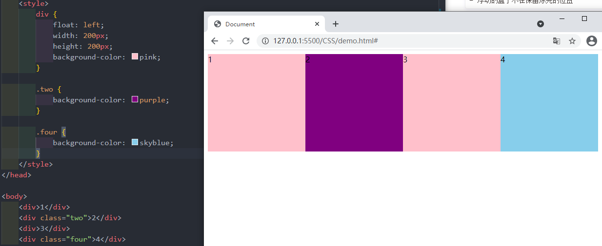
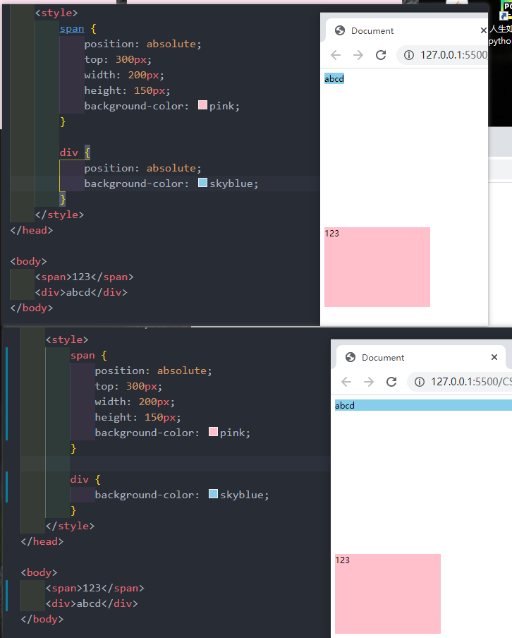

# CSS基础学习

## CSS 基础选择器

### 标签选择器

```html
// 所有相同标签选择出来
标签名 {
	属性1： 属性值1；
	属性2： 属性值2；
	属性3： 属性值3；
	...
}
```

### 类选择器

```html
// 可以选出1个或者多个标签
.类名 {
	属性1： 属性值1；
	属性2： 属性值2；
	...
}
```

#### 多类名

```html
    <style>
        .red {
            color: red;
        }
        .font35{
            font-size: 30px;
        }
    </style>

<div class="red font35">亚瑟</div>
1、在标签classa属性中写多个类名
2、多个类名中间必须用空格分开
```

### id选择器

```html
// 只能选择一个标签且只能调用一次
#id名 {    
	属性1： 属性值1；
	...
}
```

### 通配符选择器

```html
// 所有标签修改样式  不需要调用
* {
	属性1： 属性值1；
	...
}
```

## CSS 字体属性

```html
body {
	font-family: '微软雅黑';
}
```

### 字体大小

```html
body {
	font-size: 20px;
}
```

### 字体粗细

```html
// 开发中，我们跟提倡使用数字 表示加粗或者变细   700 加粗 400 不加粗
.bold{        
	font-weight: 700;
}
```

### 文字样式

```html
// italic 倾斜    normal 正常
p {
	font-style: normal;
}
```

### 字体复合属性

````html
// 有严格顺序要求   至少有size 和 family 的值
body {
	// font: font-style font-weight font-size/line-height font-family;
	font: italic 700 16px 'Microsoft yahei';
}
````

| 属性        | 表示     | 注意点                                                   |
| ----------- | -------- | -------------------------------------------------------- |
| font-size   | 字号     | 我们通常用的单位是px像素,一定要更上单位                  |
| font-family | 字体     | 实际工作中按照团队约定来写字体                           |
| font-weight | 字体粗细 | 加粗 700 or bold 不加粗 normal or 400                    |
| font-style  | 字体样式 | 倾斜是 italic 不倾斜是 normal                            |
| font        | 字体连写 | 1.字体连写是有顺序对的 不能随便换位置 2.其中字号字体必现 |

## CSS 文本属性

### 文本颜色

```html
div {
	color: red;
	color: #ff0000;
	color: rgb(200, 0, 0);
}
```

### 对齐文本

```html
div {     // left 左对齐； right 右对齐； center 剧中对齐；
	text-align: center;
}
```

### 装饰文本

```html
div {   none 默认； underline 下划线； line-throught 删除线
	text-decoration: none;
}
```

### 文本缩进

```html
div {   // 段落首行缩进  2个缩进
	text-indent: 2em
}
```

### 行间距

```html
p {
	lint-height: 26px
}
```

| 属性            | 表示     | 注意点                            |
| --------------- | -------- | --------------------------------- |
| color           | 文本颜色 | 十六进制   #fff                   |
| text-align      | 文本对齐 | 设定文本水平对齐方式              |
| text-indent     | 文本缩进 | 通常使用2个缩进  text-indent: 2em |
| text-decoration | 文本修饰 | 下划线 underline 取消下划线 none  |
| line-height     | 行高     | 控制行与行之间的距离              |

## CSS 引用方式

### 内部样式表

```html
// 内部样式表写在html页面内部，将所有css 代码抽取出来，单独放在<style> 标签中
<style>
    div {
        color: red;
        font-size: 12px;
    }
</style>
```

### 行类样式表

```html
// 行类样式表 写在body里面
<div style="color: red; font-size: 12px;">这是行类样式表</div>
```

### 外部样式表

```html
// 样式单独写在CSS文件中，之后把CSS文件引用到HTML页面中使用
第一步：
创建一个后缀名为.css 的样式文件，把所有CSS代码都放入此文件中
第二部：
写入CSS样式
div {
	color: pink;
}
第三步：
引用CSS样式
<head>
	<link rel="stylesheet" href="css文件路径">
</head>
```

| 样式表     | 优点                   | 缺点         | 使用情况 | 控制范围     |
| ---------- | ---------------------- | ------------ | -------- | ------------ |
| 行类样式表 | 书写方便               | 结构样式混写 | 较少     | 控制一个标签 |
| 内部样式表 | 部分结构和样式相分离   | 没有彻底分离 | 较多     | 控制一个页面 |
| 外部样式表 | 完全实现结构和样式分离 | 需要引入     | 推荐     | 控制多个页面 |

## Emmet 语法

```html
1.生成标签直接输入标签名按tab键即可，比如 div 然后tab键，就可以生成<div></div>
2.如果想要生成多个相同标签，加上*就可以了，比如 div*3 就可以快速生成3个div
3.如果有父子关系的标签，可以用 > 比如 ui>li 就可以了
4.如果有兄弟关系的标签，用 + 就可以了，比如 div+p
5.如果生成带有里类名或者id名字的，直接写 .demo 或者 #two tab键就可以了
6.如果生成的div类名是有顺序的，可以用自增符号 $   例如 .demo$*5
7.如果想要再生成标签内部写内容可以用 {} 表示  例如 div{我是一个div}
```

## CSS 复合选择器

### 后代选择器

```html
// 元素1 和 元素2 中间用空格隔开
// 元素1是父级，元素2是子级，最终选择的是元素2
元素1 元素2 { 样式声明 }
例如：
ul li {样式声明}   // 选择 ul 里面所有 li 标签的元素
```

### 去掉li前面的项目符号(小圆点)

```html
list-style: none;
```

### 子选择器

```html
// 元素1 和 元素2 中间用大于号隔开 
// 元素1 是父亲 元素2 是孩子，最终选择的是元素2
元素1 > 元素2 { 样式声明 }
例如：
div > p {样式声明}    // 选择 div里面所有最近的一级 p 标签元素
```

### 并集选择器

```html
// 元素1 和 元素2 中间用逗号隔开
// 逗号可以理解为和的意思
// 并集选择器通常用于集体声明
元素1,元素2 { 样式声明 }
例如：
ul,div { 样式声明 }   // 选择 ul 和 div 标签元素
```

### 伪类选择器

```html
// 注意事项
严格按照 lvha 的顺序声明：link - visited - hover - active
a:link    // 选择所有未被访问的链接
a:visited  // 选择所有已被访问的链接
a:hover   // 选择鼠标指针位于其上的链接
a:active   // 选择活动链接

例如：
/* a:hover 选择鼠标经过的那个链接 */
a:hover {
      color: skyblue;
}
```

### ：focus  伪类选择器

```html
焦点就是光标，一般情况下<input>类表单元素能获取，因此这个选择器也主要针对与表单元素来说
input:focus {
	background-color:yellow;
}
```


| 选择器         | 作用                   | 特征             | 使用情况 | 隔开符号及用法                        |
| -------------- | ---------------------- | ---------------- | -------- | ------------------------------------- |
| 后代选择器     | 用来选择后代元素       | 可以是子孙后代   | 较多     | 符号是**空格** .nav a                 |
| 子代选择器     | 选择最近一级元素       | 只选亲儿子       | 较少     | 符号是**大于** .nav >p                |
| 并集选择器     | 选择某些相同样式的元素 | 可以用于集体声明 | 较多     | 符号是**逗号**  .nav, .header         |
| 链接伪类选择器 | 选择不同状态的链接     | 跟链接相关       | 较多     | 重点记住a{} 和 a:hover 实际开发的写法 |
| ：focus 选择器 | 选择活着的光标的表单   | 跟表单相关       | 较少     | input:focus 记住这个写法              |

## CSS 的元素显示模式

#### 块元素

```html
常见的块元素有<h1>~<h6>、<p>、<div>、<ul>、<ol>、<li>等，其中<div>标签是最典型的块元素
<p>标签主要用于存放文字，因此<p>里面不能放块级元素，特别不能放<div>
<h1>~<h6>也不能放块元素
快级元素的特点：
    - 比较霸道，自己独占一行
    - 高度、宽度、外边距以及内边距都可以控制
    - 宽度默认是容器(父级宽度)的100%
    - 是一个容器及盒子，里面可以放行内或者块级元素

举例：
    <div>比较霸道，自己独占一行</div>瑟瑟发抖
```

### 行内元素

```html
常见的行内元素有<a>、<strong>、<b>、<em>、<i>、<del>、<s>、<ins>、<u>、<span>等，其中<span>标签是最典型的行内元素。
链接里面不能再放链接
特殊情况链接<a>里面可以放块级元素    
行类元素的特点：
    - 相邻对的内元素一行上，一行可以显示多个
    - 高、宽直接设置时无效的
    - 默认宽度就是它本身内容的宽度
    - 行内元素只能容纳文本或其他行内元素
举例：
    <span>pink me</span> <strong>长路漫漫</strong>
```

### 行内块元素

```html
常见的行内块元素有、<input />、<td>,它们同时具有块元素和内元素的特点。称为行内块元素
行内块元素的特点：
    - 和相邻行内元素(行内块)在一行上，但是他们之间会有空白缝隙。一行可以显示多个
    - 默认宽度就是它本身内容的宽度(行内元素特点)
    - 高度，行高、外边距以及内边距都可以控制
```


| 元素模式   | 元素排列               | 设置样式               | 默认宽度         | 包含                   |
| ---------- | ---------------------- | ---------------------- | ---------------- | ---------------------- |
| 块级元素   | 一行只能放一个块级元素 | 可以设置宽度高度       | 容器的100%       | 容器级可以包含任何标签 |
| 行内元素   | 一行可以放多个行内元素 | 不可以直接设置宽度高度 | 它本身内容的宽度 | 容纳文本或其他行内元素 |
| 行内块元素 | 一行放多个行内元素     | 可以设置宽度和高度     | 它本身内容的宽度 |                        |

### 元素显示模式转换

```html
行内元素转换成块级元素
转换为块元素：display:block;
转换为行内元素：display:inline;
```


### 一个案例：

```html
    <style>
        a {
            display: block;
            width: 230px;
            height: 40px;
            background-color: #55585a;
            font-size: 14px;
            color: #fff;
            text-decoration: none;
            text-indent: 2em;
        }
        a:hover{
            background-color: #ff6f00;
        }
    </style>


<body>
    <a href="#">手机 电话卡</a>
    <a href="#">电视 盒子</a>
    <a href="#">笔记本 平板</a>
    <a href="#">出行 穿戴</a>
    <a href="#">智能 路由器</a>
    <a href="#">健康 儿童</a>
    <a href="#">耳机 音响</a>
</body>
```

### 单行文字垂直居中

```html
line-height = height 高度
padding-top: 20px;  或者  line-height: (height 值)px;
```


## CSS 背景

### 背景颜色

```html
background-color:颜色值;
```

### CSS 背景图片

```html
background-image: url(url)
```

### CSS 背景平铺

```html
background-repeat: repeat | no-repeat | repeat-x | repeat-y
- repeat:背景图像在纵向和横向上平铺
- no-repeat：背景图像不平铺
- repeat-x：背景图像在横向平铺
- repeat-y：背景图像在纵向平铺
```

### 背景图片位置

```html
background-position:x  y;
参数代表的意思是：x坐标和y坐标。可以使用方向名词或者精确单位或混合单位
```

| 参数值   | 说明                                      |
| -------- | ----------------------------------------- |
| length   | 百分比 \|  由浮点数和单位标识符组成长度值 |
| position | top \| center \| bottom \| left \| right  |


### 背景图像固定(视差滚动)

```html
background-attachment：scroll | fixed
```

| 参数   | 作用                       |
| ------ | -------------------------- |
| scroll | 背景图像是随着对象内容滚动 |
| fixed  | 背景图像固定               |

### 背景复合写法

```html
background:背景颜色 背景图片地址 背景平铺 背景图像滚动 背景图片位置
例子：
background: #ffff url(./1.jpg) no-repeat fixed center top;
```

### 背景色半透明

```html
background: rgba(0, 0, 0, 0, 0.3);
最后一个参数是alpha透明度，取值范围0~1之间
```

| 属性                  | 作用           | 值                                                       |
| --------------------- | -------------- | -------------------------------------------------------- |
| background-color      | 背景颜色       | 预定义的颜色值/十六进制/RGB代码                          |
| background-image      | 背景图片       | url(图片路径)                                            |
| background-repeat     | 是否平铺       | repeat/no-repeat/repeat-x/repeat-y                       |
| background-position   | 背景位置       | length/position  分别是x 和 y坐标                        |
| background-attachment | 背景附着       | srcoll(背景滚动) / fixed(背景固定)                       |
| 背景复合写法          | 书写更简单     | 背景颜色 背景图片地址 背景平铺 背景图像滚动 背景图片位置 |
| 背景色半透明          | 背景颜色半透明 | background: rgba(0, 0, 0, 0.3);   后面必须是四个值       |

## CSS 三大特性

### 层叠行

```html
相同选择器给设置相同的样式，此时一个样式就会覆盖(层叠)另一个冲突的样式。层叠性主要解决样式冲突的问题
层叠性原则：
- 样式冲突。遵顼的原则就是就近原则，哪个样式离结构近，就执行哪个样式
- 样式不冲突，不会层叠
```


### 继承性

```html
CSS中的继承：子标签会继承父标签的某些样式，如文本颜色和字号
子元素可以继承父元素的样式(text- ,font- ,line- 这些元素开头的可以继承，以及color属性)

行高的继承性
body {    // 1.5 指的是 当前字体的1.5倍大
	font:12px/1.5 Microsoft YaHei;
}
```


### 优先级

```html
当同一个元素指定多个选择器，就会有优先级的产生
- 选择器相同，则执行层叠性
- 选择器不同，则根据选择器权重执行
```


## 盒子模型

### 边框（border）

```html
border 可以设置元素的边框。边框有三部分组成：边框宽度(粗细)边框样式 边框颜色
语法：
border: border-width || border-style || border-color
边框复合写法：
border: 1px solid red;  // 此复合写法没有顺序
边框分开写法：
border-top: 1px solid red;  // 只设定上边框，其余同框   top bottom left right
```

| 属性         | 作用                   |
| ------------ | ---------------------- |
| border-width | 定义边框粗细，单位是px |
| border-style | 边框样式               |
| border-color | 边框颜色               |


#### 表格的细线边框

```html
border-collapse 属性控制浏览器绘制表格边框的方式。它控制相邻单元格的边框
语法：
border-collapse: collapse;
- collapse 合并的意思
- border-collapse:collapse;  表示相邻边框合并在一起
```

### 内边距(padding)

```html
padding 属性用于设置内边距，即边框与内容之间的距离。
语法：
padding-left：5px;
内边距复合写法：
padding: 5px;   // 上下左右都有5个像素内边距;
padding: 5px 10px;  // 上下内边距是5像素 左右内边距是10像素;
padding: 5px 10px 20px;  // 上下内边距5像素 左右内边距10像素 下内边距20像素
padding: 5px 10px 20px 30px;  //  上是5像素 右10像素 下20像素 左30像素  顺时针
```

| 属性           | 作用      |
| -------------- | --------- |
| padding-left   | 左内边距  |
| padding-right  | 右内边距  |
| padding-top    | 上W内边距 |
| padding-bottom | 下内边距  |


### 外边距(margin)

```html
margin属性用于设置外边距，即控制盒子和盒子之间距离
外边距复合写法：
和内边距一样写法
```

| 属性          | 作用     |
| ------------- | -------- |
| margin-left   | 左外边距 |
| margin-right  | 右外边距 |
| margin-top    | 上外边距 |
| margin-bottom | 下外边距 |

### 外边距典型应用

```html
外边距可以让块级盒子水平居中
- 盒子必须指定宽度(width)
- 盒子左右的外边距都设置为auto
语法：
margin:0 auto;

.header {
	width:960px;
	margin:0 auto;
}
以上方法是让快元素水平居中，行内元素或者行内快元素水平居中给其父元素添加 text-align:center 即可
```

### 外边距合并

```html
嵌套快元素垂直外边距的塌陷
overflow:hidden;
```


### 清除内外边距

```html
网页元素很多都带有默认的内外边距，因此我们在布局前，首先要清除下网页元素的内外边距。
语法：
* {
	padding: 0;    // 清除内边距
	margin: 0;   // 清除外边距
}
```

### 案例1：


```html
<!DOCTYPE html>
<html lang="en">

<head>
    <meta charset="UTF-8">
    <meta http-equiv="X-UA-Compatible" content="IE=edge">
    <meta name="viewport" content="width=device-width, initial-scale=1.0">
    <title>Document</title>
    <style>
        * {
            padding: 0;
            margin: 0;
        }
        a {
            color: #333;
            text-decoration: none;
        }
        body {
            background-color: #f3f5f2;
        }

        .box {
            width: 298px;
            height: 425px;
            background-color: #fff;
            /* 让块级的盒子水平居中对齐 */
            margin: 100px auto;
        }

        .box img {
            width: 100%;
        }

        .review {
            height: 70px;
            font-size: 14px;
            padding: 0 28px;
            margin-top: 30px;
        }

        .appraise {
            font-size: 12px;
            color: #b0afb1;
            margin-top: 20px;
            padding: 0 28px
        }

        .info {
            font-size: 14px;
            margin-top: 15px;
            padding: 0 28px;
        }

        .info h4 {
            display: inline-block;
            font-weight: 400;

        }

        .info span {
            color: #ff6700;
        }
        .info em {
            font-style: normal;
            color: #ebe4e0;
            margin: 0 6px 0 9px
        }
    </style>
</head>

<body>
    <div class="box">
        <a href="#"></a>
        <p class="review"><a href="#">快递牛，整体不错蓝牙可以说秒连。红米给力</a></p>
        <div class="appraise">来自于 117384232 的评价</div>
        <div class="info">
            <h4><a href="#">Readmi AirDots真无线蓝...</a></h4>
            <em>|</em>
            <span> 99.9元</span>
        </div>
    </div>
</body>

</html>
```

### 案例2：


```html
<!DOCTYPE html>
<html lang="en">

<head>
    <meta charset="UTF-8">
    <meta http-equiv="X-UA-Compatible" content="IE=edge">
    <meta name="viewport" content="width=device-width, initial-scale=1.0">
    <title>新闻快报模块</title>
    <style>
        * {
            margin: 0;
            padding: 0;
        }

        li {
            /* 去掉li前面的小圆点 */
            list-style: none;
        }

        .box {
            width: 248px;
            height: 163px;
            border: 1px solid #ccc;
            margin: 100px auto;
        }

        .box h3 {
            height: 32px;
            border-bottom: 1px dotted #ccc;
            font-size: 14px;
            font-weight: 400;
            line-height: 32px;
            padding-left: 15px;
        }

        .box ul li a {
            font-size: 12px;
            color: #666;
            text-decoration: none;
        }

        .box ul li a:hover {
            text-decoration: underline;
        }

        .box ul li {
            height: 23px;
            line-height: 23px;
            padding-left: 20px;
        }

        .box ul {
            margin-top: 7px;
        }
    </style>
</head>

<body>
    <div class="box">
        <h3>品优导购</h3>
        <ul>
            <li><a href="#"> 【特惠】 爆款耳机5折秒!</a></li>
            <li><a href="#"> 【特惠】 母亲节，健康好礼至5折!</a></li>
            <li><a href="#"> 【特惠】 爆款手机5折秒!</a></li>
            <li><a href="#"> 【特惠】 9.9元洗100张照片!</a></li>
            <li><a href="#"> 【特惠】 长虹智能空调立省1000元!</a></li>
        </ul>
    </div>


</body>

</html>
```

### 圆角边框

```html
border-radius 属性用于设置元素的外边框圆角  
语法：
border-radius: length;
- length 可以时数值也可以是百分比新式
- 如果时正方形，想要设置为一个圆，把数值修改为高度或者宽度的一半 或者直接写为50%
```


### 盒子阴影

```html
box-shadow 属性为盒子添加阴影
语法：
box-shadow: h-shadow v-shadow blur spread color inset;
注意：
- 默认的但是外阴影(outset),但是不可以写这个单词,否则导致阴影无效
- 盒子阴影不占用控件，不会影响其他盒子排列
举例：box-shadow: 10px 10px 10px 2px rgba(0, 0, 0, .3);
```

| 值       | 描述                                 |
| -------- | ------------------------------------ |
| h-shadow | 必写。水平阴影的位置。允许负值。     |
| v-shadow | 必写。垂直阴影的位置。允许负值       |
| blur     | 可选。模糊距离                       |
| spread   | 可选。阴影的尺寸                     |
| color    | 可选。阴影的颜色。                   |
| inset    | 可选。将外部阴影(outset)改为内部阴影 |


### 文字阴影

```html
text-shadow属性将阴影应用于文本
语法：
text-shadow: h-shadow v-shadow blur color;
```

| 值       | 描述                             |
| -------- | -------------------------------- |
| h-shadow | 必写。水平阴影的位置。允许负值。 |
| v-shadow | 必写。垂直阴影的位置。允许负值   |
| blur     | 可选。模糊的距离                 |
| color    | 可选。阴影的颜色                 |


## CSS 浮动

```html
网页布局第一准则：多个块级元素横向排列找浮动纵向排列找标准流，多个块级元素横向排列找浮动。
语法：
选择器 { float:属性值; }
```

| 属性值 | 描述               |
| ------ | ------------------ |
| none   | 元素不浮动(默认值) |
| left   | 元素向左浮动       |
| right  | 元素向右浮动       |


### 浮动特性(难点1)

```html
设置了浮动(float)的元素最重要特性：
- 脱离标准普通流的控制(浮)移动到指定位置(动),(俗称拖标)
- 浮动的盒子不在保留原先的位置
```


### 浮动特性(难点2)

```html
如果多个盒子都设置了浮动，则他们会按照属性值一行内显示并且顶端对齐排列
注意：
浮动的元素时相互贴靠在一起的(不会有缝隙)，如果父级宽度装不下这些浮动的盒子，多出的盒子会另起一行对齐
```




### 浮点特性(难点3)

```html
浮动元素会具有行内块元素特性
任何元素都可以浮动。不管原先时什么模式的元素，添加浮点之后具有行内块元素享受的特性。
- 如果块级盒子没有设置宽度，默认宽度和父级一样宽，但是添加浮动后，他的大小更具内容来决定
- 浮动的盒子中间时没有缝隙的，是紧挨着一起的
- 行内元素同理
```


#### 浮点元素经常和标准流父级搭配使用

```html
现用标准的父元素排列上下位置，之后内部子元素采取浮动排列左右位置，符合网页布局第一准则
```


#### 案例1：

```html
<!DOCTYPE html>
<html lang="en">

<head>
    <meta charset="UTF-8">
    <meta http-equiv="X-UA-Compatible" content="IE=edge">
    <meta name="viewport" content="width=device-width, initial-scale=1.0">
    <title>Document</title>
    <style>
        * {
            margin: 0;
            padding: 0;
        }

        li {
            list-style: none;
        }

        .box {
            width: 1226px;
            height: 285px;
            background-color: pink;
            margin: 0 auto;
        }

        .box li {
            width: 296px;
            height: 285px;
            background-color: purple;
            float: left;
            margin-right: 14px;
        }

        .box .last {
            margin-right: 0;
        }
    </style>
</head>

<body>
    <ul class="box">
        <li>1</li>
        <li>2</li>
        <li>3</li>
        <li class="last">4</li>
    </ul>
</body>

</html>
```


#### 案例2：

```html
<!DOCTYPE html>
<html lang="en">

<head>
    <meta charset="UTF-8">
    <meta http-equiv="X-UA-Compatible" content="IE=edge">
    <meta name="viewport" content="width=device-width, initial-scale=1.0">
    <title>Document</title>
    <style>
        .box {
            width: 1226px;
            height: 615px;
            background-color: pink;
            margin: 0 auto;
        }

        .left {
            float: left;
            height: 615px;
            width: 234px;
            background-color: purple;
        }

        .right {
            float: left;
            width: 992px;
            height: 615px;
            background-color: skyblue;
        }

        .right>div {
            float:left;
            width: 234px;
            height: 300px;
            background-color: pink;
            margin-left: 14px;
            margin-bottom: 14px;
        }
    </style>
</head>

<body>
    <div class="box">
        <div class="left">左青龙</div>
        <div class="right">
            <div>1</div>
            <div>2</div>
            <div>3</div>
            <div>4</div>
            <div>5</div>
            <div>6</div>
            <div>7</div>
            <div>8</div>
        </div>
    </div>
</body>

</html>
```


### 常见网页布局

```html
<!DOCTYPE html>
<html lang="en">

<head>
    <meta charset="UTF-8">
    <meta http-equiv="X-UA-Compatible" content="IE=edge">
    <meta name="viewport" content="width=device-width, initial-scale=1.0">
    <title>Document</title>
    <style>
        * {
            margin: 0;
            padding: 0;
        }

        div {
            text-align: center;
        }

        li {
            list-style: none;
        }

        .top {
            height: 50px;
            background-color: gray;
        }

        .banner {
            width: 980px;
            height: 150px;
            background-color: gray;
            margin: 10px auto;
        }

        .box {
            width: 980px;
            margin: 0 auto;
            height: 300px;
            background-color: pink;
        }

        .box li {
            float: left;
            width: 237px;
            height: 300px;
            background-color: gray;
            margin-right: 10px;
        }

        .box .last {
            margin-right: 0;
        }

        .footer {
            height: 200px;
            background-color: gray;
            margin-top: 10px;
        }
    </style>
</head>

<body>
    <div class="top">top</div>
    <div class="banner">banner</div>
    <div class="box">
        <ul>
            <li>1</li>
            <li>2</li>
            <li>3</li>
            <li class="last">4</li>
        </ul>
    </div>
    <div class="footer">footer</div>

</body>

</html>
```


### 清除浮动

```html
由于父级盒子很多情况下，不方便给高度，但是盒子浮动又不占有位置，最后父级盒子高度为0时，就会影响下面的标准流盒子。
- 清除浮动的本质是清除浮动元素造成的影响
- 如果父盒子本身有高度，则不需要清除浮动
- 清除浮动之后，父级就会根据浮动的盒子自动检测高度。父级有了高度，就不会影响下面的标准流了(子级有多高，父级就多高)

语法：
选择器 { clear:属性值 }
```


| 属性值 | 描述                                      |
| ------ | ----------------------------------------- |
| left   | 不允许左侧有浮动元素(清除左侧浮动的影响） |
| right  | 不允许右侧有浮动元素(清除右侧浮动的影响)  |
| both   | 同时清除左右两侧浮动的影响                |

#### 清除浮动——双伪元素清除浮动

```html
.clearfix::after {
      content: "";
      display: block;
      height: 0;
      clear: both;
       visibility: hidden;
}

.clearfix {  
		/* IE6、7 专有 (可不加) */
       *zoom: 1;
}
```


#### 清除浮动总结

为什么需要清除浮动？

- 父级没高度
- 子盒子浮动了
- 影响下面布局了，我们就应该清除浮动了

### CSS 属性书写顺序

```
1.布局定位属性：display/ position/ float/ clear/ visibility/ overflow （建议display第一个写，毕竟不关系到模式）
2.自身属性：widht/ height/ margin/ padding/ border/ background
3.文本属性:color/ font/ text-decoration/ text-align/ vertical-align/ white-space/ break-word
4.其他属性(CSS3)：content/ cursor/ border-radius/ box-shadow/ text-shadow/ background:linear-gradient...
```

### CSS 定位

定位：将盒子定在某一个位置，所以定位也是在摆放盒子，按照定位的方式移动盒子。
**定位 = 定位模式 + 边偏移**
定位模式用于指定一个元素在文档中的定位方式。边偏移则决定了该元素的最终位置

子绝父相

孩子绝对定位 父亲相对定位

#### 定位模式

```html
定位模式决定元素的定位方式，它通过CSS的 position 属性来设置，其值可以分为四个
```

| 值       | 语义     |
| -------- | -------- |
| static   | 静态定位 |
| relative | 相对定位 |
| absolute | 绝对定位 |
| fixed    | 固定定位 |

#### relative (相对定位)

```html
相对定位是元素在移动位置的时候，是相对于它原来的位置来说的
语法：
选择器 { position: releative; }
相对定位的特点：
- 它是相对于自己原来的位置来移动的(移动位置的时候参照点是自己原来的位置)
- 原来在标准流的位置继续占有，后面的盒子仍然以标准流的方式对待它(不脱标，继续保留原来位置)
```

#### absolute(绝对定位)

```html
绝对定位是元素在移动位置的时候，是相对于它祖先元素来说的
语法：
选择器 { position:absolute; }
绝对定位的特点：
- 如果没有祖先元素或者祖先元素没有定位，则以浏览器为准定位
- 如果祖先元素有定位(相对、绝对、固定定位)，则以最近一级的有定位的祖先定位元素为参考移动位置
- 绝对定位不在占用原先的位置
```

#### fixed(固定定位)

```html
固定定位是元素固定于浏览器可视区的位置。主要使用场景：可以在浏览器页面滚动时元素的位置不会改变
语法：
选择器 { position: fixed; }
固定定位的特点：
- 以浏览器的可视窗口为参照点移动的元素
- 跟父元素没有任何关系
- 不随滚动条滚动
- 固定定位不占有原来的位置
小技巧：  // 固定在版心右侧位置
1.让固定定位的盒子left：50%，走到浏览器可视区一半的位置
2.让固定定位的盒子margin-left：版心宽度的一半距离。 多走版心宽度一半位置
```

#### sticky(粘性定位)

```html
粘性定位可以被认为是相对定位和固定定位的混合
语法：
选择器 { position:sticky;top:10px; }
粘性定位的特点：
- 以浏览器的可视窗口为参照点移动元素(固定定位特点)
- 粘性定位占有原来的定位(相对定位特点)
- 必须添加top、left、right、bottom其中一个才有效
```


#### 边偏移

```html
边偏移就是定位的盒子移动到最终位置。有top、bottom、left、right 四个属性
```

| 值     | 示例         | 描述                                             |
| ------ | ------------ | ------------------------------------------------ |
| top    | top: 80px    | 顶端偏移量，定义元素相对其父元素上边线的距离     |
| bottom | bottom: 80px | 底部偏移量，定义元素相对其父元素下边线的距离     |
| left   | left: 80px   | 左侧偏移量，定义元素相对于其他父元素左边线的距离 |
| right  | right: 80px  | 右侧偏移量，定义元素相对于其他父元素右边线的距离 |

#### 定位总结

| 定位模式         | 是否脱标       | 移动位置           | 是否常用 |
| ---------------- | -------------- | ------------------ | -------- |
| static           | 否             | 不能使用边偏移     | 很少     |
| relative相对定位 | 否(占有位置)   | 相对于自身位置移动 | 常用     |
| absolute绝对定位 | 是(不占有位置) | 带有定位的父级     | 常用     |
| fixed固定定位    | 是(不占有位置) | 浏览器可视区       | 常用     |
| sticky粘性定位   | 否(占有位置)   | 浏览器可视区       | 一般     |

### 定位叠放次序(z-index)

```html
在使用定位布局时，可能会出现盒子重叠的情况。此时，可以使用z-index来控制盒子的前后次序
语法：
选择器 { z-index:1; }
- 数值可以时正整数、负整数或0，默认时auto，数值越大，盒子越靠上
- 如果属性值相同，则按照书写顺序，后来居上
```


### 绝对定位的盒子居中

```html
加了绝对定位的盒子不能通过margin:0 auto 水平居中，但是可以通过以下计算方法和垂直居中
- left:50%;:让盒子的左侧移动到父级元素的水平中心位置。
- margin-left:-100px：让盒子向左移动自身宽度的一半
```


```html
绝对定位和固定定位也和浮动类似
- 行内元素添加绝对或者固定定位，可以直接设置高度和宽度。
- 块级元素添加绝对或者固定定位，如果不给宽度或者高度，默认大小是内容的大小
```



```html
绝对定位(固定定位)会完全压住盒子
浮动元素不同，只会压住它下面的标准流的盒子，但是不会压住下面标准流盒子里面的文字
但是绝对定位(固定定位)会压住下面标准流所有的内容
浮动之所以不会压住文字，因为浮动产生的目的最初是为了做文字坏绕效果的。文字会围绕浮动元素
```


### 定位综合案例

```html
<!DOCTYPE html>
<html lang="en">

<head>
    <meta charset="UTF-8">
    <meta http-equiv="X-UA-Compatible" content="IE=edge">
    <meta name="viewport" content="width=device-width, initial-scale=1.0">
    <title>淘宝轮播图做法</title>
    <style>
        * {
            margin: 0;
            padding: 0;
        }
        
        li {
            list-style: none;
        }
        
        .tb-promo {
            position: relative;
            width: 520px;
            height: 280px;
            background-color: pink;
            margin: 100px auto;
        }
        
        .tb-promo.img {
            width: 520px;
            height: 280px;
        }
        /* 公共代码抽离 */
        
        .prev,
        .next {
            position: absolute;
            top: 50%;
            /* 绝对定位的盒子垂直居中 */
            margin-top: -15px;
            /* 加了绝对定位的盒子可以直接设置宽度和高度 */
            width: 20px;
            height: 30px;
            background-color: rgba(0, 0, 0, .3);
            text-align: center;
            line-height: 30px;
            color: #fff;
            text-decoration: none;
        }
        
        .prev {
            left: 0;
            border-top-right-radius: 15px;
            border-bottom-right-radius: 15px;
        }
        
        .next {
            right: 0;
            border-top-left-radius: 15px;
            border-bottom-left-radius: 15px;
        }
        
        .promo-nav {
            position: absolute;
            bottom: 15px;
            left: 50%;
            margin-left: -35px;
            width: 70px;
            height: 13px;
            background: rgba(255, 255, 255, .3);
            border-radius: 7px;
        }
        
        .promo-nav li {
            float: left;
            width: 8px;
            height: 8px;
            background-color: rgb(0, 0, 0);
            border-radius: 50%;
            margin: 3px;
        }
        
        .promo-nav .selected {
            background-color: #ff5000;
        }
    </style>
</head>

<body>
    <div class="tb-promo">
        
        <!-- 左侧按钮 -->
        <a href="#" class="prev"> &lt; </a>
        <!-- 右侧按钮 -->
        <a href="#" class="next"> &gt; </a>
        <!-- 小圆点 -->
        <ul class="promo-nav">
            <li class="selected"></li>
            <li></li>
            <li></li>
            <li></li>
            <li></li>
        </ul>
    </div>
</body>

</html>
```


### 网页布局总结

#### 1标准流

```可以让盒子上下排列或者左右排列，垂直的块级盒子显示就用标准流布局```


#### 2浮动

```可以让多个块级元素一行显示或者左右对齐盒子，多个块级盒子水平显示就用浮动布局```


#### 3定位

```定位最大的特点是有层叠概念，就是可以让多个盒子前后叠压来显示。如果元素自由在某个盒子内移动就用定位布局。```


### 元素的显示与隐藏

```让一个元素在页面中隐藏或者显示出来```

#### display属性

```html
display 属性用于设置一个元素应如何显示
- display: none;; 隐藏对象
- display: block; 除了转换为块级元素之外，同时还有显示元素的意思
display隐藏元素后，不再占有原来的位置
用途及其广泛，搭配JS做特效
```

#### visibility 可见性

```html
visibility 属性用于指定一个元素应可见还是隐藏
- visibility:visible;  元素可见
- visibility:hidden; 元素隐藏
visibility隐藏元素后，继续占有原来的位置
```

#### overflow 溢出

```html
overflow 属性指定了如果内容溢出一个元素的框(超出其指定高度及宽度)时，会发生什么
```

| 属性值  | 描述                                       |
| ------- | ------------------------------------------ |
| visible | 不剪切内容也不添加滚动条                   |
| hidden  | 不显示超过对象尺寸的内容，超出的部分隐藏掉 |
| scroll  | 不管超出内容否，总是显示滚动条             |
| auto    | 超出自动显示滚动条，不超出不显示滚动条     |

```html
<!DOCTYPE html>
<html lang="en">

<head>
    <meta charset="UTF-8">
    <meta http-equiv="X-UA-Compatible" content="IE=edge">
    <meta name="viewport" content="width=device-width, initial-scale=1.0">
    <title>Document</title>
    <style>
        .tudou {
            position: relative;
            width: 444px;
            height: 320px;
            background-color: pink;
            margin: 30px auto;
        }

        .tudou img {
            width: 100%;
            height: 100%;
        }

        .mask {
            display: none;
            position: absolute;
            top: 0;
            left: 0;
            width: 100%;
            height: 100%;
            background: rgba(0, 0, 0, .4) url(img/播放.png) no-repeat center;
        }

        .tudou:hover .mask {
            display: block;
        }
    </style>
</head>

<body>
    <div class="tudou">
        <div class="mask"></div>
        
    </div>
</body>

</html>
```


## CSS 高级技巧

### 字体图标下载

- icomoon 字库 https://icomoon.io/
- 阿里 iconfont 字库 https://www.iconfont.cn/
- https://www.bilibili.com/video/BV1pE411q7FU?p=256&spm_id_from=pageDriver

### 字体图标的引用

https://www.bilibili.com/video/BV1pE411q7FU?p=257&spm_id_from=pageDriver

### 字体图标追加

https://www.bilibili.com/video/BV1pE411q7FU?p=258&spm_id_from=pageDriver

### CSS 倒三角

```html
网页常见一些三角形，都是使用css直接画出来的
```


#### 案例

```html
<style>
    .box1 {
        width: 0;
        height: 0;
        border-top: 50px solid pink;
        border-right: 50px solid red;
        border-bottom: 50px solid blue;
        border-left: 50px solid green;
    }

    .box2 {
        width: 0;
        height: 0;
        border: 50px solid transparent;
        border-top-color: pink;
        margin: 100px auto;
    }

    .jd {
        position: relative;
        width: 120px;
        height: 249px;
        background-color: pink;
    }

    .jd span {
        position: absolute;
        right: 15px;
        top: -10px;
        width: 0;
        height: 0;
        line-height: 0;
        font-size: 0px;
        border: 5px solid transparent;
        border-bottom-color: pink;
    }
</style>

<body>
    <div class="box1"></div>
    <div class="box2"></div>
    <div class="jd">
        <span></span>
    </div>
</body>
```


### CSS 用户界面样式

#### 鼠标样式 cursor

```html
语法：
li { cursor: pointer; }

例子:
<ul>
        <li style="cursor: default;">我是默认的小白鼠标样式</li>
        <li style="cursor: pointer;">我是鼠标小手样式</li>
        <li style="cursor: move;">我是鼠标移动样式</li>
        <li style="cursor: text;">我是鼠标文本样式</li>
        <li style="cursor: not-allowed;">我是鼠标禁止样式</li>
</ul>
```

| 属性值      | 描述 |
| ----------- | ---- |
| default     | 小白 |
| pointer     | 小手 |
| move        | 移动 |
| text        | 文本 |
| not-allowed | 禁止 |

#### 轮廓线 outline

```html
语法：
input { outline: none; }

例子：     // 建议一开始就取消轮廓线
<style>
        input {
            outline: none;
        }
</style>

<body>
    <input type="text">
</body>
```

#### 防止拖拽文本域 resize

```html
语法：
textarea { resize: none;}

例子：
<style>
    textarea {
        resize: none;
    }
</style>

<body>
    <textarea name="" id="" cols="30" rows="10"></textarea>
</body>
```

### vertical-align 属性应用

```CSS 的 vertical-align 属性使用场景：经常用于设置图片或者表单(行内块元素)和文字垂直对齐```

```html
语法：
vertical-align: baseline | top | middle | bottom

bug:图片低侧会有一个空白缝隙，原因是行内块元素回合文字的基线对齐
主要解决方法有两种
- 给图片添加 vertical-align: middle | top | bottom 等
- 把图片转换为块级元素 display: block;
例子：
<style>
    img {
        /* 让图片和文字垂直居中 */
        vertical-align: middle;
    }
</style>

<body>
    这是一个淘宝轮播图
</body>
```

| 值       | 描述                                   |
| -------- | -------------------------------------- |
| baseline | 默认。元素放置在父元素的基线上         |
| top      | 把元素的顶端与行中最高元素的顶端对齐   |
| middle   | 把此元素放置在父元素的中部             |
| bottom   | 把元素的顶端与行中最低的元素的顶端对齐 |


### 溢出的文字用省略号显示

#### 单行文本溢出显示省略号--必须满足三个条件

```html
/* 1.这个单词的意思是如果文字显示不开自动换行 */
white-space: nowrap;
/* 2.溢出的部分隐藏起来 */
overflow: hidden;
/* 3.文字溢出的时候用省略号来显示 */
text-overflow: ellipsis;
```


### CSS 初始化

```html
/* 把我们所有标签的内外边距清零 */
* {
margin: 0;
padding: 0;
/* CSS3盒子模型 */
box-sizing: border-box;
}

/* em 和 i 斜体的文字不倾斜 */
em,
i {
font-style: normal;
}

/* 去掉li标签的小圆点 */
li {
list-style: none;
}

img {
/* border: 0 照顾低版本浏览器 如果图片 外面包含了连接会有边框的问题 */
border: 0;
/* 取下图片低侧有空白缝隙 */
vertical-align: middle;
}

button {
/* 当我们鼠标经过button 按钮的时候，鼠标变成小手 */
cursor: pointer;
}

a {
color: #666;
/* 取消下划线 */
text-decoration: none;
}

a :hover {
/* 经过a标签会变成红色 */
color: #c81623;
}

button,
input {
/* \588B\4F53 宋体 */
font-family: Microsoft YaHei, Heiti SC, tahoma, arial, Hiragino Sans GB, "\588B\4F53", sans-serif;
/* 默认有灰色边框手动去掉 */
border: 0;
/* 去掉蓝色框框 */
outline: none;
}
}

body {
/* 抗锯齿形 让文字显示更加清晰 */
-webkit-font-smoothing: antialiased;
background-color: #fff;
font-family: Microsoft YaHei, Heiti SC, tahoma, arial, Hiragino Sans GB, "\588B\4F53", sans-serif;
color: #666;
}
```

## HTML5 的新特性

### HTML5 新增的多媒体标签

`视频<video>`

```html
语法：
<video src="文件地址" controls="controls"></video>
```

| 属性     | 值                         | 描述                               |
| -------- | -------------------------- | ---------------------------------- |
| autoplay | autoplay                   | 视频就绪自动播放                   |
| controls | controls                   | 向用户显示播放控件                 |
| width    | 像素                       | 设置播放器宽度                     |
| height   | 像素                       | 设置播放器高度                     |
| loop     | loop                       | 播放完是否继续播放该视频，循环播放 |
| preload  | auto 预加载；none 不预加载 | 规定是否预加载视频                 |
| src      | url                        | 视频url地址                        |
| poster   | Imgurl                     | 加载等待的画面图片                 |
| muted    | muted                      | 静音播放                           |

`音频<audio>`

```html
语法：
<audio src="文件地址" controls="controls"></audio>
```

| 属性     | 值       | 描述                                           |
| -------- | -------- | ---------------------------------------------- |
| autoplay | autoplay | 如果出现该属性，则音频就绪后马上播放           |
| controls | controls | 如果出现该属性，则向用户显示控件，比如播放按钮 |
| loop     | loop     | 播放完是否继续播放该视频，循环播放             |
| src      | url      | 要播放的音频的url                              |

`input类型`

```html
语法：
<!-- 我们验证的时候必须添加form表单域 -->
<form action="">
    <ul>
        <li>邮箱： <input type="email" /></li>
        <!-- 当我们点击提交按钮就可以验证表单了 -->
        <li> <input type="submit" value="提交"></li>
    </ul>    
</form>    
```

| 属性          | 说明                        |
| ------------- | --------------------------- |
| type="email"  | 限制用户输入必须为Email类型 |
| type="url"    | 限制用户输入必须为url类型   |
| type="date"   | 限制用户输入必须为日期类型  |
| type="time"   | 限制用户输入必须为时间类型  |
| type="month"  | 限制用户输入必须为月类型    |
| type="week"   | 限制用户输入必须为周类型    |
| type="number" | 限制用户输入必须为数字类型  |
| type="tel"    | 手机号码                    |
| type="search" | 搜索框                      |
| type="color"  | 生成一个颜色选择表单        |

### 表单

````html
语法：
 <input type="search" name="" id="" required="required" placeholder="测试">
````

| 属性         | 值        | 说明                                           |
| ------------ | --------- | ---------------------------------------------- |
| required     | required  | 表单拥有该属性表示其内容不能为空，必填         |
| placeholder  | 提示文本  | 表单的提示信息，页面加载完成自动聚焦到指定表单 |
| autofocus    | autofocus | 自动聚焦属性，页面加载完成自动聚焦到指定表单   |
| autocomplete | off/on    | 浏览器记录以前的记录默认是打开                 |
| multiple     | multiple  | 可以多选文件提交                               |

## CSS3 的新特性

### CSS3 新增选择器

`属性选择器`

```html
<style>
    /* 只选取 type=text 文本框的input 选取出来 */
    input[type=text] {
        color: pink
    }
</style>

<body>
    <!-- 属性选择器还可以选择属性=值的某些元素 -->
    <input type="text" name="" id="">
    <input type="password" name="" id="">
</body>
```


`结构伪类选择器`

```html
<style>
    /* 1.选择ul里面的第一个孩子 小Li */

    ul li:first-child {
        background-color: pink;
    }
    /* 2.选择ul里面的最后一个孩子 小Li */

    ul li:last-child {
        background-color: pink;
    }
    /* 3.选择ul里面的第二个孩子 小Li */

    ul li:nth-child(4) {
        background-color: blue;
    }
</style>

<body>
    <ul>
        <li>我是第1个孩子</li>
        <li>我是第2个孩子</li>
        <li>我是第3个孩子</li>
        <li>我是第4个孩子</li>
        <li>我是第5个孩子</li>
        <li>我是第6个孩子</li>
        <li>我是第7个孩子</li>
        <li>我是第8个孩子</li>
        <li>我是第9个孩子</li>
    </ul>
</body>
```


 `结构伪类选择器`奇偶选择

```html
<style>
    /* 1.把所有偶数 even的孩子选出来 */
    ul li:nth-child(even) {
        background-color: blue;
    }
    /* 2.把所有奇数 odd的孩子选出来 */
    ul li:nth-child(odd) {
        background-color: blue;
    }
</style>

<body>
    <ul>
        <li>我是第1个孩子</li>
        <li>我是第2个孩子</li>
        <li>我是第3个孩子</li>
        <li>我是第4个孩子</li>
        <li>我是第5个孩子</li>
        <li>我是第6个孩子</li>
        <li>我是第7个孩子</li>
        <li>我是第8个孩子</li>
        <li>我是第9个孩子</li>
    </ul>
</body>
```

`伪元素选择器`

```html
<style>
    div {
    width: 200px;
    height: 200px;
    background-color: pink;
    }

    div::before {
    /* 这个content是必须要写的 */
    content: '我';
    }

    div::after {
     /* 这个content是必须要写的 */
    content: '冉勇';
    }
</style>
```

| 选择符   | 简介                     |
| -------- | ------------------------ |
| ::before | 在元素内部的前面插入内容 |
| ::after  | 在元素内部的后面插入内容 |


#### 伪元素选择器使用场景1：伪元素字体图标

```html
div::after {
    position: absolute;
    top: 10px;
    right: 10px;
    font-family: 'icomoon';
    content: '\e904';
    color: red;
    font-size: 18px;
}
```

### 伪元素选择器使用场景2：伪元素清楚浮动

```html
方法一：
.clearfix:after {
	content: "";	// 伪元素必须写的属性
	display: block;	// 插入的元素必须是块级
	height: 0;	// 不要看见这个元素
	clear: both;	// 核心代码清楚浮动
	visibility: hidden;	// 不要看见这个元素
}
方法二：
.clearfix:before,.clearfix:after {
	content: "";
	display: table;	// 转换为块级元素并且一行显示
}
.clearfix:after {
	clear:both;
}
```

#### CSS3 盒子模型

```html
CSS3 中可以通过box-sizing来指定盒模型，有2个值：即可指定为content-box、border-box，这样我们计算盒子大小的方式就发生了改变

可以分成两种情况：
1、box-sizing:content-box 盒子大小为 width+ paadding+ border 
2、box-sizing:border-box 盒子大小为width
```


#### CSS3 其他特性

`1、图片变模糊`

`2、计算盒子宽度width:calc函数`

**CSS3 滤镜filter：**

```html
filter CSS属性将模糊或颜色偏移等图形效果应用于元素
语法：
filter: 函数()；
举例：
filter:blur(5px);  blur模糊处理 数值越大越模糊
```

**CSS3 calc 函数：**

```html
calc() 此CSS函数让你在声明CSS属性值时执行一些计算
width:calc(100% - 80px);     // 随宽度减去80像素
括号里面可以 + - * / 来进行计算
```


 **CSS3 过渡**

```html
traaansition: 要过渡的属性 花费时间 运动曲线 何时开始；
1、属性： 想要变化的 CSS 属性，宽度高度 背景颜色 内外边距都可以。如果想要所有的属性都变化，写一个all就可以。
2、花费时间： 单位是 秒(必须写单位) 比如 0.5s
3、运动曲线：默认是ease(可以省略)
4、何时开始：单位是 秒(必须填写单位)可以设置延迟触发时间 默认 0s (可以省略)  
谁做过渡，给谁加
例子：
<!DOCTYPE html>
<html lang="en">

<head>
    <meta charset="UTF-8">
    <meta http-equiv="X-UA-Compatible" content="IE=edge">
    <meta name="viewport" content="width=device-width, initial-scale=1.0">
    <title>Document</title>
    <style>
        div {
            width: 200px;
            height: 100px;
            background-color: pink;
            /* transition: 变化的属性 花费时间 运动曲线 何时开始; */
            /* transition: width .5s； */
            /* 如果想要写多个属性，利用逗号进行分割 */
            /* transition: width .5s, height .5s; */
            /* 如果想要多个属性都变化，属性写all就可以了 */
            /* 谁做过渡，给谁加 */
            transition: all .5s;
        }

        div:hover {
            width: 300px;
            height: 200px;
            background-color: skyblue;
        }
    </style>
</head>

<body>
    <div></div>
</body>

</html>
```

**过渡案例2**

```html
<!DOCTYPE html>
<html lang="en">

<head>
    <meta charset="UTF-8">
    <meta http-equiv="X-UA-Compatible" content="IE=edge">
    <meta name="viewport" content="width=device-width, initial-scale=1.0">
    <title>Document</title>
    <style>
        .bar {
            width: 150px;
            height: 15px;
            border: 1px solid red;
            border-radius: 7px;
            padding: 1px
        }
        
        .bar_in {
            width: 50%;
            height: 100%;
            background-color: red;
            transition: all .5s;
        }
        
        .bar:hover .bar_in {
            width: 100%;
        }
    </style>
</head>

<body>
    <div class="bar">
        <div class="bar_in"></div>
    </div>
</body>

</html>
```