<style type="text/css">
    h1 { counter-reset: h2counter; }
    h2 { counter-reset: h3counter; }
    h3 { counter-reset: h4counter; }
    h4 { counter-reset: h5counter; }
    h5 { counter-reset: h6counter; }
    h6 { }
    h2:before {
      counter-increment: h2counter;
      content: counter(h2counter) ".\0000a0\0000a0";
    }
    h3:before {
      counter-increment: h3counter;
      content: counter(h2counter) "."
                counter(h3counter) ".\0000a0\0000a0";
    }
    h4:before {
      counter-increment: h4counter;
      content: counter(h2counter) "."
                counter(h3counter) "."
                counter(h4counter) ".\0000a0\0000a0";
    }
    h5:before {
      counter-increment: h5counter;
      content: counter(h2counter) "."
                counter(h3counter) "."
                counter(h4counter) "."
                counter(h5counter) ".\0000a0\0000a0";
    }
    h6:before {
      counter-increment: h6counter;
      content: counter(h2counter) "."
                counter(h3counter) "."
                counter(h4counter) "."
                counter(h5counter) "."
                counter(h6counter) ".\0000a0\0000a0";
    }
</style>

# Vue3项目实战

## 电商后台管理系统

项目源码：[码云](https://gitee.com/ran_yong/vue_shop)

### 前端项目的技术栈

- vue
- vue-router
- Element-UI
- Axios
- Echarts

### 后端项目技术栈

- Node.js
- Express
- Jwt
- Mysql
- sequelize

## 项目前端初始化

### 安装Vue脚手架

```shell
npm install -g @vue/cli
```

### 通过Vue脚手架创建项目

```shell
vue ui
```

### 配置Element—UI组件库

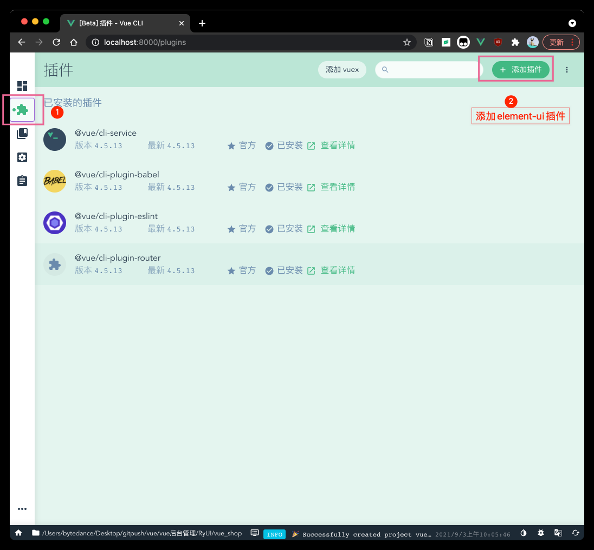

### 配置Axios库

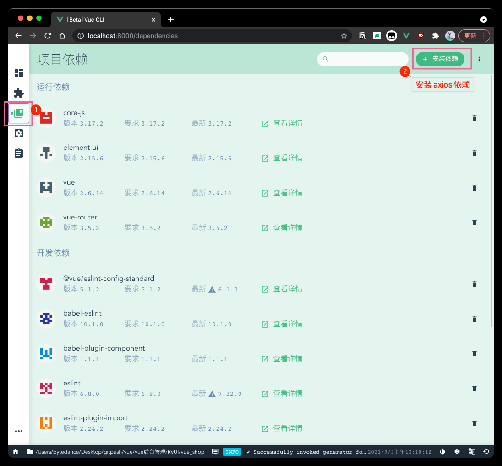

### 配置less、less-loader开发依赖

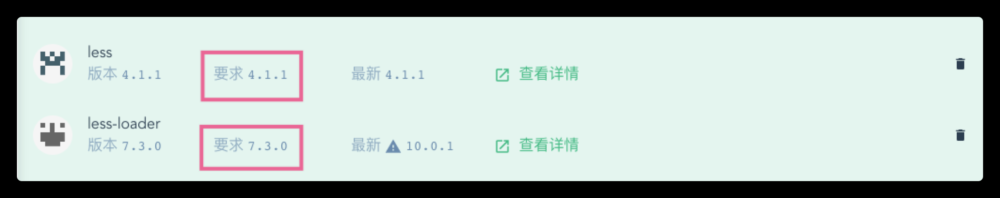

### 项目所有依赖

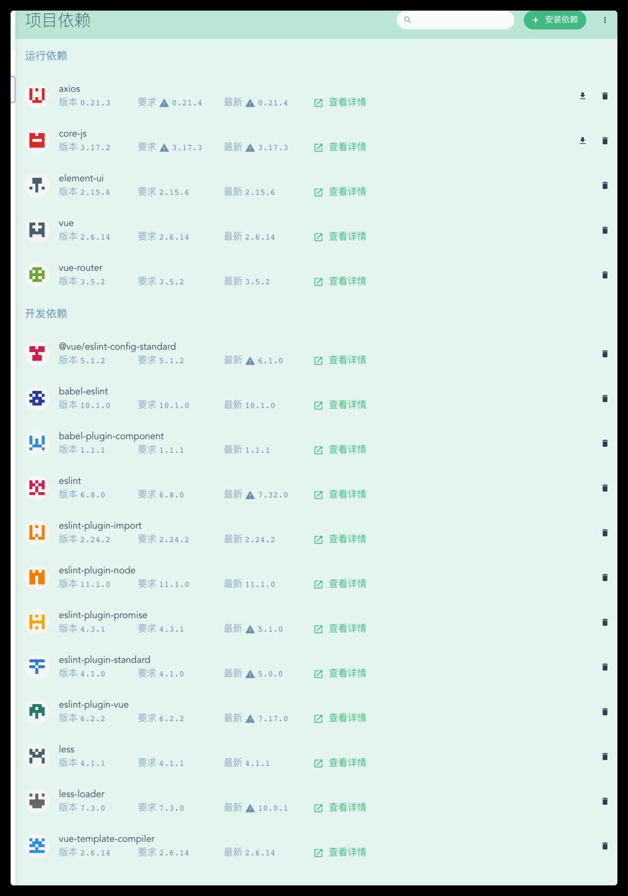

### 启动服务并启动app

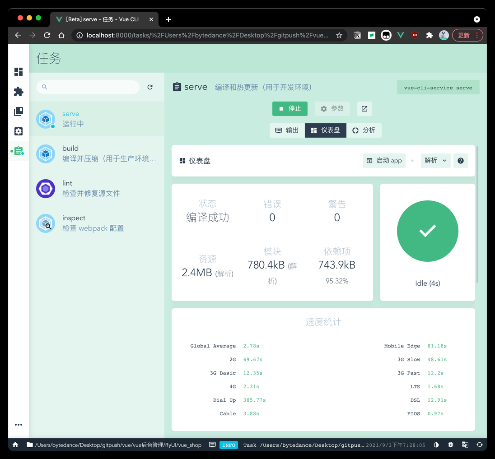

### 初始化git远程仓库

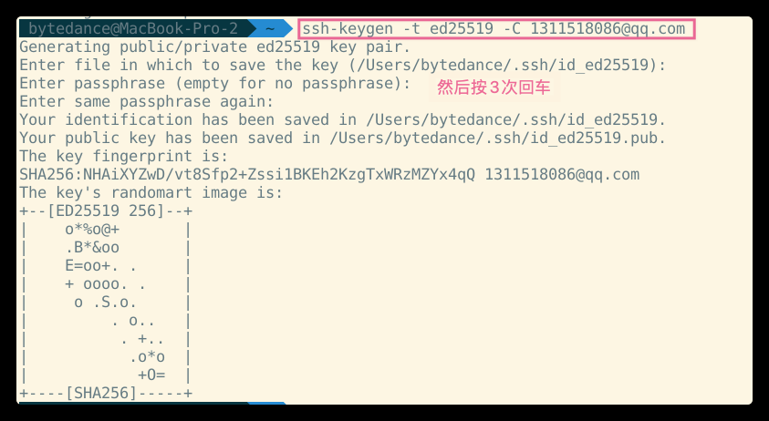

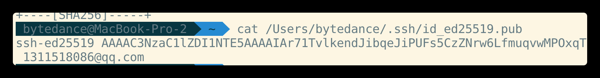

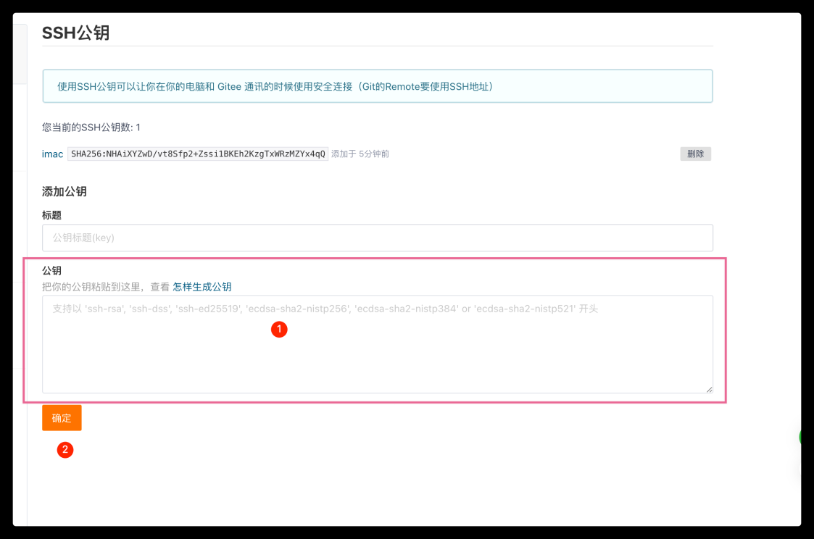

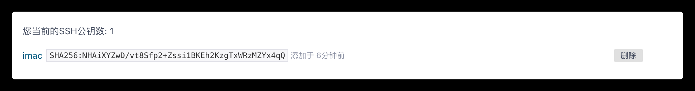

### 将本地项目托管到github或码云中

## 项目后端初始化

### 安装MySql数据库

[bilibili视频观看](https://www.bilibili.com/video/BV1E7411c7M8?p=9&spm_id_from=pageDriver)

### 安装Node.js环境

[Node官网](https://nodejs.org/zh-cn/)

### 配置项目相关信息

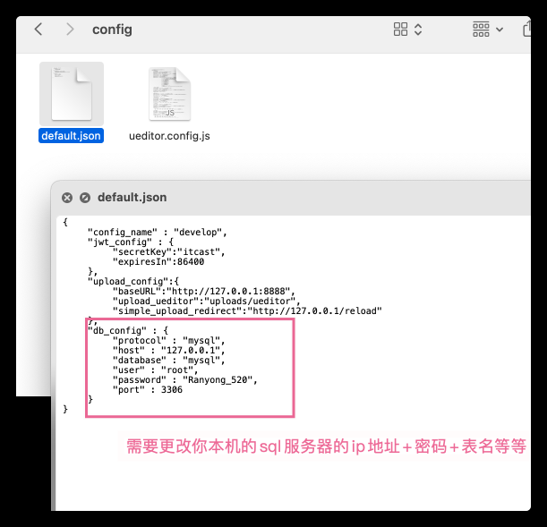

### 启动项目

```shell
node app.js
```

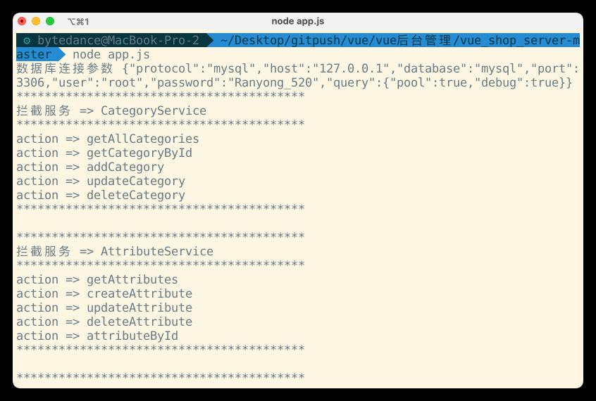

### 使用Postman测试后台项目接口是否正常

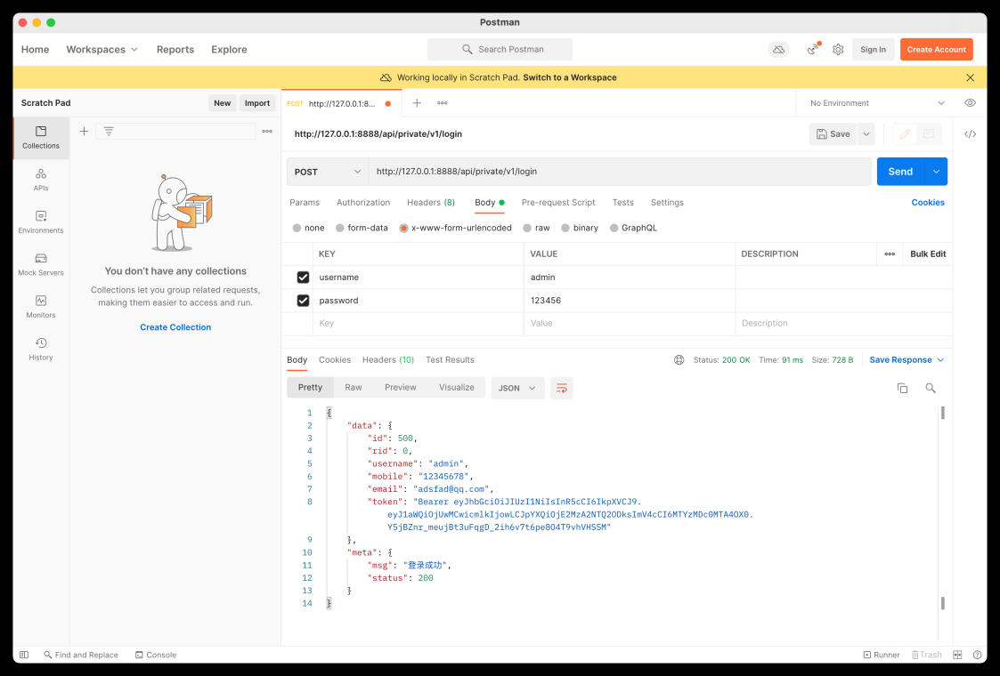

## git使用大全

- 创建子分支

`git checkout -b 分支名字`

- 查看当前所有分支

`git branch`

- 将代码添加到暂存区

`git add .`

- 查看上次提交之后是否有进行再次修改

`git status`

- 提交代码

`git commit -m "备注"`

- 切换主分支

`git checkout master`

- 合并代码

`git merge 分支`

- 推送到代码管理仓库(码云/github)

`git push -u origin 仓库名(-u 是没有将分支推送到仓库的操作)`

`git push`
